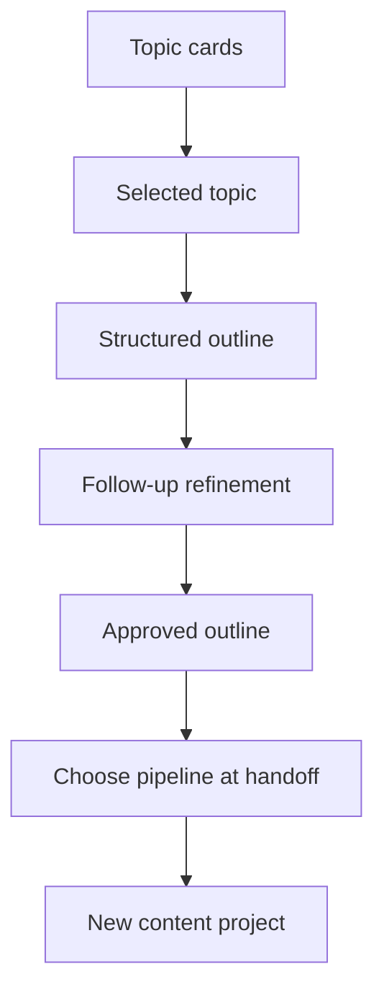

# Creator Outline Lab Requirements

## Summary

Extend the Inspiration Lab from topic discovery into a pre-pipeline outline workspace. A creator can pick a topic, generate a structured outline, refine it through follow-up prompts, and hand off the approved outline into a new content project.

---

## Problem Frame

The current Creator Workbench already separates pre-pipeline exploration from fixed content execution: Inspiration Lab helps a creator find and refine a topic, then hands context into a Content Project. The next friction point is the gap between "this topic sounds good" and "I know how to make it." A topic alone can still leave the creator staring at the first pipeline step and re-opening an external AI chat to build a usable structure.

This brainstorm treats that external outline-building behavior as a product hypothesis, not a proven fact. The requirement should make the workflow testable: if creators already turn topics into outlines elsewhere, the workbench should keep that step inside the same Inspiration Lab session and preserve the handoff context.

---

## Actors

- A1. Multi-platform solo creator using the Creator Workbench to turn a content idea into one publishable project.
- A2. Product/operator reviewing whether Inspiration Lab sessions convert into started and completed content projects.

---

## Key Decisions

- **Extend Inspiration Lab, not the project page.** The outline experience belongs before pipeline choice so creators can explore structure without committing to short video or long article too early.
- **Generate a structured outline, not a near-final draft.** The first version should reduce blank-page pressure while leaving script, body, and platform-specific production work to the Content Pipeline.
- **Support multi-turn refinement before handoff.** A single generated outline is not enough; the creator must be able to ask for changes until the structure feels usable.
- **Choose the pipeline at handoff.** The outline remains broadly usable in the lab, then the handoff step adapts it to the selected pipeline.

---

## Key Flows

- F1. Topic becomes an outline
  - **Trigger:** The creator selects or refines a topic in Inspiration Lab and wants a usable structure.
  - **Actors:** A1
  - **Steps:** The creator requests an outline, reviews the structured result, and edits or asks follow-up prompts to improve it.
  - **Outcome:** The creator has a usable structure before creating a content project.
  - **Covered by:** R1, R2, R3, R4

- F2. Creator refines the outline until ready
  - **Trigger:** The first outline is too broad, too shallow, misaligned with the brand, or missing a stronger hook.
  - **Actors:** A1
  - **Steps:** The creator asks for targeted changes, compares the updated outline with the current direction, and keeps iterating in the same lab session.
  - **Outcome:** The outline reflects the creator's intent without leaving the workbench.
  - **Covered by:** R5, R6, R7

- F3. Outline hands off into a Content Project
  - **Trigger:** The creator is satisfied with the outline and wants to start execution.
  - **Actors:** A1
  - **Steps:** The creator chooses a target pipeline, reviews what will be injected into the new project, edits the handoff payload if needed, and confirms.
  - **Outcome:** The new content project starts with topic and outline context already available.
  - **Covered by:** R8, R9, R10

---

## Requirements

**Outline generation**

- R1. Inspiration Lab must let a creator generate a structured outline from a selected or refined topic without first creating a content project.
- R2. The structured outline must include a central angle or claim, an opening hook, 3-5 section or segment points, and a closing CTA or takeaway.
- R3. Outline generation must apply the creator's Brand Profile when available and warn when brand context is missing.
- R4. The outline surface must keep the original topic visible so the creator can judge whether the structure still serves the idea.

**Refinement**

- R5. The creator must be able to refine the outline through follow-up prompts in the same Inspiration Lab session.
- R6. Refinement must preserve the current outline instead of forcing the creator to restart from topic cards.
- R7. The creator must be able to abandon the outline path and return to topic exploration without losing the selected topic in the current session.

**Handoff**

- R8. The creator must choose the target Content Pipeline only when handing off the approved outline.
- R9. Handoff must show a mapping preview that explains what topic and outline content will enter the new content project.
- R10. The creator must be able to edit the handoff payload before confirming project creation.
- R11. The resulting content project must start with non-empty topic and outline context rather than an empty first-step editor.

**Quotas and state**

- R12. Outline generation and outline refinement must count against the Inspiration Lab quota rather than in-pipeline AI quota.
- R13. When Inspiration Lab quota is exhausted, the creator may still review the current outline but cannot request new outline generation or refinement.
- R14. The outline session should follow Inspiration Lab's existing session expectations, including clear warning if unsaved work may be lost.

---

## Acceptance Examples

- AE1. **Covers R1, R2.** Given a creator has selected a topic in Inspiration Lab, when they request an outline, then the lab shows a structured outline with a central angle, opening hook, 3-5 main points, and a closing CTA or takeaway.
- AE2. **Covers R5, R6.** Given an outline exists, when the creator asks "make this more practical for beginners," then the lab updates the outline while preserving the current outline context.
- AE3. **Covers R8, R9, R10.** Given the creator approves an outline, when they start handoff, then they choose a pipeline and see an editable preview of what will be injected.
- AE4. **Covers R11.** Given the creator confirms handoff, when the new content project opens, then the relevant early pipeline step already contains topic and outline context.
- AE5. **Covers R12, R13.** Given the creator has no Inspiration Lab quota left, when they try to refine the outline, then the action is blocked with quota guidance while the existing outline remains visible.

---

## Success Criteria

- SC1. A creator can move from selected topic to first structured outline without creating a content project.
- SC2. A creator can complete at least one refinement turn before handoff without leaving Inspiration Lab.
- SC3. A project created from an approved outline opens with enough context that the first pipeline step is not blank.
- SC4. Validation should track outline generation rate, outline refinement rate, outline-to-project handoff rate, and handoff project completion rate.

---

## Scope Boundaries

### Deferred for later

- Batch outline generation for many topics.
- User-saved outline templates or a reusable template library.
- Version diff or side-by-side comparison across outline revisions.
- Cross-project works library or content calendar.
- Pipeline-specific outline variants before handoff.

### Outside this product's identity

- Automatic publishing or platform API integration.
- A general-purpose document editor inside Inspiration Lab.
- User-defined infinite workflows or custom pipeline builders.
- Replacing the fixed Content Pipeline with an open-ended chat product.

---

## Dependencies / Assumptions

- Inspiration Lab remains the pre-pipeline space for topic exploration and handoff.
- The existing Content Pipeline remains the execution space for scripts, bodies, production notes, and publish checklist work.
- The need for outline refinement is based on a plausible creator workflow and should be validated with users.
- Brand Profile context remains the default source for tone, audience, taboos, and structure preferences.

---

## Outstanding Questions

### Resolve before planning

- None.

### Deferred to planning

- [Affects R9, R10][Technical] Define the exact handoff mapping from generic structured outline into each supported Content Pipeline.
- [Affects R12, R13][Technical] Confirm whether outline generation and refinement share the existing Inspiration Lab quota bucket or need a visible sub-label.
- [Affects R14][Technical] Decide whether v1 keeps outline state in the current lab session only or introduces server-side draft persistence.
- [Affects SC4][Technical] Decide which creator events are needed to measure outline generation, refinement, handoff, and downstream completion.

---

## Sources / Research

- `CONCEPTS.md` defines Inspiration Lab as the pre-pipeline playground and Content Pipeline as the fixed execution workflow.
- `docs/brainstorms/2026-06-25-creator-topic-playground-requirements.md` defines topic generation, refinement, quota separation, and handoff expectations.
- `docs/brainstorms/2026-05-22-creator-ai-workflow-hub-requirements.md` defines the broader Creator Workbench workflow from inspiration into fixed content pipelines.
- `docs/brainstorms/2026-06-29-creator-projects-management-hub-requirements.md` preserves Inspiration Lab as the entry point for creators who do not yet have a concrete topic.
