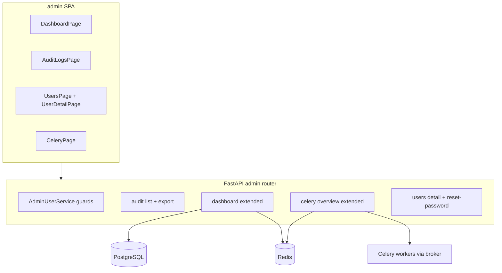

# Admin 二期：运维可见性与治理增强

## Summary

在现有管理后台基础上，按「护栏 → 审计 → 仪表盘 → Celery → 用户详情」顺序交付五类能力：防止零 admin、可筛选/导出审计、增强系统状态卡片、深化 Celery/Beat 展示、单用户详情与一次性临时密码重置。后端延续 `require_admin` + 分层架构；前端在 `admin/` 扩展页面与 API 客户端。

---

## Problem Frame

一期后台已覆盖登录、用户表格、基础仪表盘、Celery inspect 与只读审计，但值班与账号治理仍依赖多处工具切换，且存在误操作风险（如移除最后一名管理员）。二期将运维与治理收敛到同一 SPA，满足 origin 文档 R1–R14 与流程 F1–F3。(see origin: docs/brainstorms/2026-05-18-admin-phase2-requirements.md)

---

## Requirements Trace

| ID | 计划单元 | 说明 |
|----|----------|------|
| R1–R2 | U3 | 仪表盘系统状态与降级文案 |
| R3–R5 | U2 | 审计筛选（补全 UI）、详情、CSV 导出 |
| R6–R8 | U1 | 最后 admin 护栏 + 前端确认 |
| R9–R11 | U4 | Beat 调度列表、失败/空状态、Flower 外链（可选） |
| R12–R14 | U5 | 用户详情、操作、临时密码重置 |
| F1 | U3, U4 | 值班巡检 |
| F2 | U1, U2, U5 | 用户个案 |
| F3 | U2 | 事后追溯 |
| AE (R6,R7,R2,R5,R10) | U1–U4 测试场景 | 见各单元 |

---

## Scope Boundaries

**In scope**
- R1–R14 对应 API 与 `admin/` UI
- 配置项：`admin_audit_export_max_rows`（默认 5000）、`admin_reported_api_replicas`（可选）、`flower_url`（可选）

**Deferred for later**（来自 origin）
- 2FA、会话撤销、Loki 日志、配置热改、告警、RBAC 多角色

**Deferred to Follow-Up Work**
- 邮件重置密码流程（需 SMTP 配置）
- iframe 嵌入 Flower

**Outside this product's identity**
- 完整 BI、低代码 后台、多租户

---

## Key Technical Decisions

| 决策 | 理由 |
|------|------|
| R14 采用**一次性临时密码** API 返回，不落库明文历史 | 模板无邮件服务；满足 R14 最小可行 (origin Q1 默认) |
| 导出 CSV 用**流式 Response** + 行数上限 | 避免大结果集占满内存 (origin Q2 → 5000 默认) |
| Beat 健康度用 **Redis 心跳键**（`heartbeat` 任务写入，带 TTL） | 现有 heartbeat 仅打日志，仪表盘需可观测信号 |
| API 副本数来自 **`ADMIN_REPORTED_API_REPLICAS` 环境变量** | Docker Compose 可注入 `SCALE_API`；本机 dev 无副本概念时显示「未配置」 |
| 迁移版本查询 **`alembic_version` 表** + 与 head revision 比较 | 不 shell 调 alembic CLI |
| Flower 二期仅 **配置 URL + 管理页外链** | 满足 R11 可选；不做 iframe (origin Q3) |
| 护栏逻辑放在 **service 层**，repository 提供 `count_active_admins` | 与现有 `AdminUserService` 模式一致 |

---

## Open Questions

### Resolved During Planning

- **R14 机制：** 临时密码一次性展示（见上表）。
- **R5 上限：** 默认 5000，可通过 `ADMIN_AUDIT_EXPORT_MAX_ROWS` 配置。
- **R11 Flower：** 有 `FLOWER_URL` 时在 Celery 页显示外链；无则隐藏。

### Deferred to Implementation

- Celery `reserved` / 失败任务是否可从 result backend 拉取更多字段——先依赖 inspect `active` + 文档化限制。
- 是否在 `heartbeat` 任务失败时写入 Redis 错误状态——实现时若简单则一并写入。

---

## High-Level Technical Design

> *Directional guidance for review, not implementation specification.*

---

## Implementation Units

- U1. **管理员安全护栏（R6–R8）**

**Goal:** 阻止将系统置于零 active admin；敏感操作有明确错误码。

**Requirements:** R6, R7, R8, F2; Covers AE for R6/R7

**Dependencies:** None

**Files:**
- Modify: `app/repositories/user.py`
- Modify: `app/services/admin_users.py`
- Modify: `app/schemas/admin.py`（如需新错误码文档）
- Modify: `admin/src/pages/UsersPage.tsx`
- Test: `tests/api/test_admin_users.py`

**Approach:**
- `UserRepository.count_active_admins() -> int`
- 在 `update_user` 前：若变更后 `active_admin_count < 1` 则 `AppException` code `40005`
- 保留现有 self-demotion / self-deactivate 规则
- 前端：改角色、停用前 `window.confirm`；失败时展示 API message

**Patterns to follow:**
- 现有 `40003`/`40004` 自我限制逻辑于 `app/services/admin_users.py`

**Test scenarios:**
- Happy path: 两名 admin，A 停用 B → 成功，剩 1 名 admin
- Error path: 仅 1 名 active admin 尝试降级自己 → `40004`（已有）
- Error path: 仅 1 名 active admin，另一 admin 已 inactive，无法再降 → `40005`
- Covers AE R6: 唯一 admin 自降权 → 403/400
- Covers AE R7: 两 admin A 停 B → 允许

**Verification:**
- `pytest tests/api/test_admin_users.py` 通过且覆盖新 code

---

- U2. **审计日志筛选与 CSV 导出（R3–R5）**

**Goal:** 完整筛选 UX、单条详情、可导出 CSV。

**Requirements:** R3, R4, R5, F3; Covers AE R5

**Dependencies:** None（API 已支持 since/until/actor；补 UI 与 export）

**Files:**
- Modify: `app/repositories/audit_log.py`（`iter_for_export` 生成器）
- Modify: `app/api/v1/admin/audit.py`（`GET /audit-logs/export`）
- Modify: `app/core/config.py`, `.env.example`
- Modify: `admin/src/pages/AuditLogsPage.tsx`
- Modify: `admin/src/api/audit.ts`
- Test: `tests/api/test_audit_logs.py`

**Approach:**
- Export 端点复用 list 过滤参数；`StreamingResponse` + `text/csv`
- 上限 `admin_audit_export_max_rows`（默认 5000），超出截断并在响应头或首行注释说明（可选）
- 前端：日期范围输入、详情 modal 展示 `detail` JSON

**Patterns to follow:**
- `ApiResponse` 信封；现有 `list_paginated` 于 `app/repositories/audit_log.py`

**Test scenarios:**
- Happy path: 带 `since`/`until`/`action` 筛选与分页一致
- Error path: 非 admin → 403
- Edge case: 超过 max rows 时返回行数 capped
- Covers AE R5: CSV 列含时间/action/actor/resource/IP

**Verification:**
- 新测试 export 返回 `text/csv` 且行数 ≤ 配置上限

---

- U3. **仪表盘系统状态增强（R1–R2）**

**Goal:** 一屏展示 ready、迁移、Beat、API 副本等运维信号。

**Requirements:** R1, R2, F1; Covers AE R2

**Dependencies:** U4 中心跳 Redis 键（可先实现 U3 写入，或 U3/U4 同 PR 内协调：U3 含 heartbeat 写入）

**Files:**
- Modify: `app/tasks/scheduled.py`（heartbeat 写 Redis 键 `celery:beat:heartbeat` + TTL）
- Modify: `app/schemas/admin.py`（`SystemOverview` 扩展字段）
- Modify: `app/services/admin_dashboard.py`
- Modify: `app/api/v1/admin/dashboard.py`
- Modify: `admin/src/pages/DashboardPage.tsx`, `admin/src/types/api.ts`
- Modify: `docker-compose.yml`（api 环境 `ADMIN_REPORTED_API_REPLICAS`）
- Test: `tests/api/test_admin_dashboard.py`

**Approach:**
- 扩展 `DashboardStats`：`ready_status`, `migration_at_head`, `migration_revision`, `beat_status`, `beat_last_seen`, `api_replicas_reported`, `api_replicas_note`
- `ready` 复用现有 DB/Redis 检查 + 汇总 `ok/error`
- `migration_at_head`: 读 `alembic_version` 与 `alembic/scripts` head 比较（实现时读 DB + 配置 revision）
- `beat_last_seen`: Redis GET 心跳键时间戳
- `api_replicas_reported`: 来自 settings，未设置则 `null` + note「本机开发未配置」

**Patterns to follow:**
- `app/api/v1/health.py` ready 逻辑
- `AdminDashboardService._check_services`

**Test scenarios:**
- Happy path: 全栈健康时各字段 `ok`
- Error path: Redis down → `redis` error 且带 message（Covers AE R2）
- Edge case: 无 `ADMIN_REPORTED_API_REPLICAS` → 副本显示为未配置而非 0

**Verification:**
- 扩展 `test_admin_dashboard` 断言新字段存在

---

- U4. **Celery 监控深化（R9–R11）**

**Goal:** Beat 调度表、更清晰状态语义、可选 Flower 链接。

**Requirements:** R9, R10, R11, F1; Covers AE R10

**Dependencies:** U3（共享 heartbeat Redis；可同 PR 合并实现 heartbeat 写入）

**Files:**
- Modify: `app/schemas/admin.py`（`BeatScheduleEntry`, 扩展 `CeleryOverview`）
- Modify: `app/services/admin_celery.py`
- Modify: `app/core/config.py`, `.env.example`
- Modify: `admin/src/pages/CeleryPage.tsx`, `admin/src/types/api.ts`
- Test: `tests/api/test_admin_celery.py`

**Approach:**
- 从 `celery_app.conf.beat_schedule` 序列化调度项（name, task, schedule 描述）
- 区分 `unavailable`（ping 空）vs `degraded`（ping 有 inspect 失败）
- `failed_tasks`: inspect `reserved` + 解析失败状态（可得则展示）
- `flower_url` 非空时前端显示「打开 Flower」外链（`target=_blank`）

**Patterns to follow:**
- 现有 `AdminCeleryService` ping/parallel inspect

**Test scenarios:**
- Happy path: mock inspect 返回 worker + schedule
- Error path: 无 worker → `unavailable` + 明确 message（Covers AE R10）
- Edge case: `flower_url` 未配置 → 不显示链接

**Verification:**
- 扩展 celery 测试覆盖 `beat_schedule` 字段

---

- U5. **用户详情与重置密码（R12–R14）**

**Goal:** 单用户视图、关联审计、临时密码重置。

**Requirements:** R12, R13, R14, F2

**Dependencies:** U1（护栏）, U2（审计列表按 actor 过滤）

**Files:**
- Modify: `app/api/v1/admin/users.py`（`GET /users/{id}/audits`, `POST /users/{id}/reset-password`）
- Modify: `app/services/admin_users.py`
- Modify: `app/schemas/admin.py`（`UserDetail`, `PasswordResetResult`）
- Modify: `admin/src/App.tsx`（路由 `users/:id`）
- Create: `admin/src/pages/UserDetailPage.tsx`, `admin/src/pages/UserDetailPage.module.css`
- Modify: `admin/src/api/users.ts`, `admin/src/pages/UsersPage.tsx`
- Test: `tests/api/test_admin_users.py`（新用例）

**Approach:**
- `GET /users/{id}` 已有；新增 `GET /users/{id}/audit-logs?limit=20`
- `POST .../reset-password`：生成随机密码、`get_password_hash`、更新用户、审计 `user.reset_password`（detail 不含明文密码；响应体仅返回一次 `temporary_password`）
- 详情页复用列表的 PATCH 与确认逻辑

**Patterns to follow:**
- `scripts/create_admin.py` 密码哈希
- `AuthService` / security helpers

**Test scenarios:**
- Happy path: 获取详情含审计列表
- Happy path: reset 后可用新密码登录
- Error path: reset 目标为最后一名 admin 且会导致锁定 → 不适用；reset 不改变 role
- Integration: reset 产生 `user.reset_password` 审计记录

**Verification:**
- API 测试覆盖 reset；手动验证详情页路由

---

## System-Wide Impact

- **Interaction graph:** 仅 `admin` 路由与 `admin/` SPA；`heartbeat` 任务多写 Redis 键，不影响业务 API。
- **Error propagation:** 护栏错误统一 `AppException` → 现有 handler。
- **API surface parity:** 无 v2 变更；OpenAPI 随 admin router 扩展。
- **Unchanged invariants:** 公开 `auth/register`、非 admin 的 `/metrics` 仍匿名；admin metrics summary 仍受 JWT 保护。

---

## Risks & Dependencies

| Risk | Mitigation |
|------|------------|
| 临时密码在响应中泄露若被日志记录 | 审计不记录明文；文档警告勿记录 access log body |
| CSV 导出大量数据慢 | 流式 + 行数上限 |
| 本机 dev 无副本/Beat 信号误导 | UI 显示「未配置」/「未知」说明 |
| 修改 heartbeat 增加 Redis 写 | TTL 键轻量；失败不影响任务返回 |

---

## Documentation / Operational Notes

- 更新 `AGENTS.md`：新环境变量、`FLOWER_URL`、export 限制
- 更新 `README.md` Admin 小节：重置密码、导出审计
- `docker-compose.yml` 为 `api` 服务添加 `ADMIN_REPORTED_API_REPLICAS=${SCALE_API:-1}`

---

## Sources & References

- **Origin document:** [docs/brainstorms/2026-05-18-admin-phase2-requirements.md](docs/brainstorms/2026-05-18-admin-phase2-requirements.md)
- Existing admin: `app/api/v1/admin/`, `admin/src/`
- Patterns: `app/services/admin_users.py`, `app/repositories/audit_log.py`
