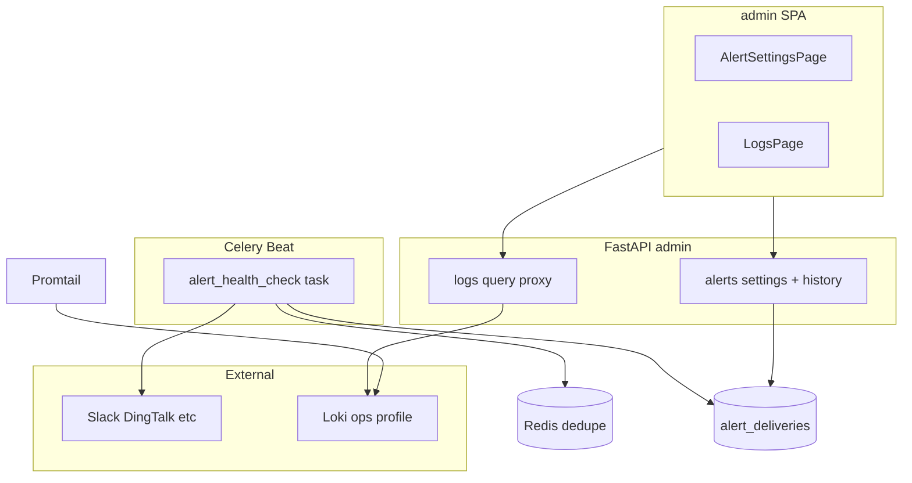

# Admin 三期：运维跑道（告警 Webhook + 可选 Loki 日志）

## Summary

在二期仪表盘与 Beat 心跳基础上，按「告警数据模型与配置 API → 健康检测与 Webhook 投递 → Compose 日志 profile → admin 日志查询 UI」顺序交付：可配置出站告警、发送记录、测试发送，以及可选 profile 下的 `request_id` 只读日志检索。后端延续 `require_admin` + 分层架构；前端在 `admin/` 新增告警设置页与日志页。

---

## Problem Frame

二期已把健康、Celery、审计收敛进 admin，但无人盯盘时故障触达慢，且日志仍依赖 CLI。三期收口 origin 文档 R1–R12，满足流程 F1–F3。(see origin: [docs/brainstorms/2026-05-18-admin-phase3-ops-requirements.md](../brainstorms/2026-05-18-admin-phase3-ops-requirements.md))

---

## Requirements Trace

| ID | 计划单元 | 说明 |
|----|----------|------|
| R1–R8 | U1, U2 | Webhook 配置、检测、投递、记录、测试、未配置降级 |
| R9 | U3 | Compose 可选 profile（Loki + 采集） |
| R10–R12 | U4 | Admin 只读日志查询与 UI 降级 |
| F1 | U2 | 被动告警触达 |
| F2 | U1 | 告警配置与验证 |
| F3 | U4 | request_id 查日志 |
| AE (R2,R3,R8,R7,R10,R12) | U1–U4 测试 | 见各单元 |

---

## Scope Boundaries

**In scope**
- R1–R12 对应 API、`admin/` UI、迁移、`.env.example`、Compose profile、README/AGENTS 更新
- 配置项（规划默认）：`alert_webhook_url`、`alert_webhook_secret`（可选）、`alert_dedupe_seconds`、`alert_worker_zero_enabled`、`loki_url`（API 查询用）

**Deferred for later**（来自 origin）
- 配置只读快照、2FA、RBAC、配置热改、Alertmanager、邮件/短信告警、日志导出

**Outside this product's identity**
- 多租户、BI、低代码、全功能任务 UI

---

## Key Technical Decisions

| 决策 | 理由 |
|------|------|
| Webhook 配置存 **DB 表**（单行或 key-value），admin CRUD + 审计 | 满足 R1/R7 UI 修改；环境变量可作启动种子 (origin Q webhook storage) |
| 健康检测由 **Celery Beat 定时任务**（如每 1–2 分钟）执行 | 复用现有 beat；与 API 请求路径解耦 |
| 去重状态存 **Redis**（`alert:sent:{event_type}` + TTL） | 轻量、与二期心跳键模式一致 |
| Payload **通用 JSON** + `docs/` 或 README 适配示例 | 满足 R5，无厂商 SDK |
| 发送记录表 **`alert_deliveries`**（元数据列） | 满足 R6，不存 response body |
| 恢复通知默认 **开启**（`beat_recovered`、`ready_recovered`） | 降低误报焦虑；可配置关闭 |
| Worker 零检测默认 **关闭** | R4 可选；降低误报（dev 常无 worker） |
| Loki 使用 **官方镜像 + Promtail** 采集 `api_logs` volume 或 stdout | 与现有 `api_logs` volume 对齐；profile 名 `ops` 扩展或 `observability` |
| 日志查询 API **代理 Loki query_range** | admin 不暴露 Loki 公网；限流 + `limit` 参数 |
| 未配置 `LOKI_URL` 时日志 API 返回 **503 + 明确 code** | 前端 R12 降级文案 |

---

## High-Level Technical Design

---

## Implementation Units

### U1. 告警配置、发送记录与测试 API（R1, R6–R8, F2）

**Goal:** 管理员可配置 Webhook、查看发送历史、触发测试。

**Requirements:** R1, R6, R7, R8, F2

**Dependencies:** None

**Files:**
- Create: `app/models/alert_settings.py`, `app/models/alert_delivery.py`（或合并 settings 单表）
- Create: `alembic/versions/*_alert_tables.py`
- Create: `app/repositories/alert.py`
- Create: `app/services/admin_alerts.py`
- Create: `app/schemas/admin_alerts.py`
- Create: `app/api/v1/admin/alerts.py`
- Modify: `app/api/v1/admin/router.py`
- Modify: `app/core/config.py`, `.env.example`（可选种子 URL）
- Create: `admin/src/pages/AlertSettingsPage.tsx`, `admin/src/api/alerts.ts`
- Modify: `admin/src/App.tsx`, `admin/src/components/AdminLayout.tsx`（导航）
- Test: `tests/api/test_admin_alerts.py`

**Approach:**
- `GET/PATCH /api/v1/admin/alerts/settings`：url、secret（写入不回显完整 secret，仅 `configured: true`）、`recovery_notifications_enabled`
- `GET /api/v1/admin/alerts/deliveries`：分页，字段 `created_at`, `event_type`, `success`, `http_status`
- `POST /api/v1/admin/alerts/test`：发送 `event_type=test`，写 delivery 行
- PATCH settings 写审计 `alert.settings_update`
- 未配置 url 时 test 返回 400 + 明确 message

**Verification:** `pytest tests/api/test_admin_alerts.py`

---

### U2. 健康检测与 Webhook 投递（R2–R5, F1）

**Goal:** 自动检测 ready/beat（及可选 worker）异常并 POST JSON，带去重与恢复通知。

**Requirements:** R2, R3, R4, R5, F1; Covers AE R2, R3, R8

**Dependencies:** U1（读取 settings 与写 deliveries）

**Files:**
- Create: `app/services/alert_monitor.py`（检测逻辑 + payload 构建 + httpx 异步 POST）
- Modify: `app/tasks/scheduled.py`（新任务 `check_and_send_alerts`）
- Modify: `app/tasks/celery_app.py`（`beat_schedule` 增加检测间隔）
- Modify: `app/core/config.py`（`alert_dedupe_seconds`, `alert_worker_zero_duration_seconds`, `alert_worker_zero_enabled`）
- Create: `docs/admin-alert-webhook.md`（Slack/钉钉 payload 映射示例）
- Test: `tests/api/test_alert_monitor.py` 或 `tests/services/test_alert_monitor.py`（mock httpx + redis）

**Approach:**
- 检测复用 `AdminDashboardService` / health 同等逻辑：DB ping、Redis ping、`BEAT_HEARTBEAT_REDIS_KEY` TTL
- 可选 worker：`AdminCeleryService` worker 数 == 0 持续 N 秒（Redis 记 `alert:worker_zero_since`）
- 事件类型枚举：`ready_failed`, `ready_recovered`, `beat_missing`, `beat_recovered`, `workers_missing`, `workers_recovered`, `test`
- Redis 去重键 `alert:dedupe:{event_type}`，TTL = `alert_dedupe_seconds`（默认 300）
- Payload 示例字段：`event`, `environment`, `summary`, `timestamp`, `details`（可选）
- 可选 HMAC：`X-Signature` header（secret 配置时）
- 失败写 delivery 行 `success=false`

**Test scenarios:**
- DB down → 一条 `ready_failed`，dedupe 内不重复
- Beat 键恢复 → `beat_recovered`
- 无 webhook url → 任务 no-op
- Covers AE R8: 无 URL 不崩溃

**Verification:** 单元/集成测试 + 手动 mock Webhook（如 webhook.site）

---

### U3. Compose 日志 profile（R9）

**Goal:** 可选启动 Loki + Promtail，采集 API/worker JSON 日志。

**Requirements:** R9

**Dependencies:** None（可与 U4 并行，但 U4 依赖本单元部署）

**Files:**
- Modify: `docker-compose.yml`（`loki`, `promtail` 服务，`profiles: ["ops"]` 或新 `observability`）
- Create: `docker/loki/loki-config.yml`, `docker/promtail/promtail-config.yml`
- Modify: `.env.example`（`LOKI_URL=http://loki:3100`）
- Modify: `README.md`, `AGENTS.md`（启动说明）

**Approach:**
- Loki 单节点 dev 配置，短保留（如 7d 或 168h）
- Promtail 挂载 `api_logs` 或 scrape container logs（与 structlog JSON 行格式一致）
- Flower 与 Loki 同属 `ops` profile 或文档列出 `docker compose --profile ops up -d loki promtail flower`

**Verification:** `docker compose --profile ops up -d` 后 Loki ready；Promtail 有 stream

---

### U4. Admin 日志只读查询（R10–R12, F3）

**Goal:** 管理员按 request_id 等筛选日志；未启用 Loki 时明确降级。

**Requirements:** R10, R11, R12, F3; Covers AE R10, R12

**Dependencies:** U3（生产查询）；实现可 mock Loki 测 API

**Files:**
- Create: `app/services/admin_logs.py`（httpx 调 Loki `query_range` / LogQL 构建）
- Create: `app/api/v1/admin/logs.py`
- Modify: `app/api/v1/admin/router.py`
- Modify: `app/core/config.py`（`loki_url`, `loki_query_timeout`, `loki_max_lines`）
- Create: `admin/src/pages/LogsPage.tsx`, `admin/src/api/logs.ts`
- Modify: `admin/src/App.tsx`, `AdminLayout` 导航
- Test: `tests/api/test_admin_logs.py`（无 LOKI_URL → 503；mock Loki → 200）

**Approach:**
- `GET /api/v1/admin/logs?since=&until=&request_id=&level=&q=&page=&page_size=`
- LogQL 构造：`{job="api"} |= "request_id"` 等（实现时按 promtail labels 调整）
- 响应：`items[]` 含 `timestamp`, `level`, `message`, `request_id`, `raw`（完整 JSON）
- `loki_url` 空：503 + code `50301` + message 提示启用 ops profile
- 前端：筛选表单、表格、详情 drawer；无 Loki 时展示 R12 说明块

**Verification:** `pytest tests/api/test_admin_logs.py`

---

## Suggested Delivery Order

1. **U1** → **U2**（告警闭环可独立演示）
2. **U3** → **U4**（日志可第二 PR 或同 PR 后半）

---

## System-Wide Impact

- **Interaction graph:** 新增 Beat 任务读 DB/Redis/Celery inspect；写 Webhook 出站；admin 只读 Loki。
- **Error propagation:** 告警发送失败不抛到用户 API；仅记 delivery。
- **Security:** Webhook secret 不回显；日志 API 仅 admin；Loki 不经过 Caddy 公网暴露。
- **Unchanged:** 公开 auth、非 admin 路由不受影响。

---

## Risks & Dependencies

| Risk | Mitigation |
|------|------------|
| Webhook 刷屏 | Redis 去重 + 可配置间隔 |
| 误报 worker 为零 | 默认关闭 R4 检测 |
| Loki 磁盘增长 | 短保留 + 文档说明 |
| LogQL 与 label 不一致 | U3/U4 同 PR 联调；测试用固定 fixture |
| 出站 Webhook SSRF | 仅 admin 可配置 URL；可选禁止内网 IP（planning 评估） |

---

## Documentation / Operational Notes

- 更新 `AGENTS.md`：告警与 Loki 环境变量、`--profile ops`
- 更新 `README.md`：Admin 告警设置、日志查询、Webhook 适配链接
- 新增 `docs/admin-alert-webhook.md`

---

## Sources & References

- **Origin:** [docs/brainstorms/2026-05-18-admin-phase3-ops-requirements.md](../brainstorms/2026-05-18-admin-phase3-ops-requirements.md)
- **Prior phase:** [docs/plans/2026-05-18-001-feat-admin-phase2-ops-governance-plan.md](2026-05-18-001-feat-admin-phase2-ops-governance-plan.md)
- Patterns: `app/services/admin_dashboard.py`, `app/tasks/scheduled.py`, `app/repositories/audit_log.py`
