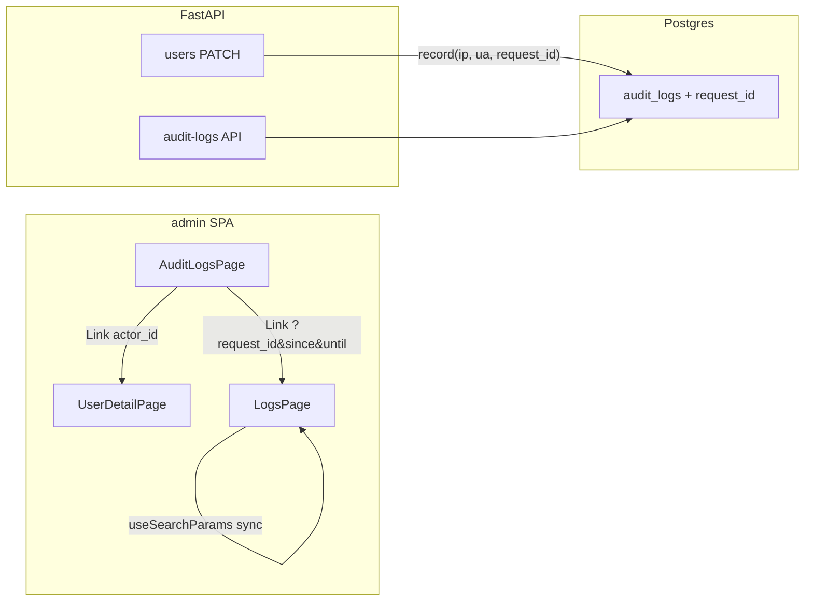

# Admin 排障串联：URL 深链与审计 request_id

## Summary

按 origin 两步交付顺序实现：先在 `admin/` 增加日志页 URL 查询参数双向同步、request_id 复制与审计→用户跳转；再经 Alembic 迁移为 `audit_logs` 增加可空 `request_id` 列，在 admin 写操作审计时从 structlog 上下文持久化，并在审计 UI 提供「查日志」深链。R5（日志→用户）与 R9（审计按 request_id 筛选）本期不做。

---

## Problem Frame

三期已支持按 `request_id` 查日志与审计筛选，但无法分享日志查询 URL，且审计未保存 `request_id`，排障仍需手动复制 ID。(see origin: [docs/brainstorms/2026-05-20-admin-trace-request-requirements.md](../brainstorms/2026-05-20-admin-trace-request-requirements.md))

---

## Requirements

- R1. 日志页读取 URL 查询参数并自动查询
- R2. 已提交筛选与 URL 同步
- R3. request_id 一键复制
- R4. 审计 actor_id 跳转用户详情
- R5. ~~日志→用户~~（本期 out，见 Scope）
- R6. admin 写审计持久化 request_id
- R7. 审计 API/UI 展示 request_id；历史为 null 显示「—」
- R8. 审计详情「查日志」跳转并预填时间范围
- R9. ~~审计按 request_id 筛选~~（v1 out）

**Origin actors:** A1 管理员, A2 运维/开发者  
**Origin flows:** F1 审计→日志, F2 分享日志链接, F3 审计→用户  
**Origin acceptance examples:** AE（R6/R7/R8/R1）, AE（R2/R1）, AE（R4）, AE（R7）, AE（R8/R12）

---

## Scope Boundaries

- R1–R4、R6–R8 对应 API 与 `admin/` UI；无新 Compose 服务
- 前端深链单元（U1–U2）可先于后端迁移合并
- R5 out：structlog 未绑定 `user_id`，Loki 行无稳定用户字段（见 Resolved During Planning）
- R9 out v1：仅详情展示 + 跳日志，不做列表筛选
- 历史审计 backfill、告警→日志、调查聚合页（origin deferred）

### Deferred to Follow-Up Work

- R9 审计列表 `request_id` 筛选 + 可选索引优化
- R5 若未来在 auth 中间件绑定 `user_id` 到 structlog，再补日志→用户链接
- `/ce-compound` 沉淀 URL 深链与 Loki 分页经验

---

## Context & Research

### Relevant Code and Patterns

- 日志页筛选：`admin/src/pages/LogsPage.tsx`（草稿 vs 已提交 `filters`、`queryKey` 仅含 filters）
- 审计页：`admin/src/pages/AuditLogsPage.tsx`（Modal 详情、`actor_id` 截断展示）
- 跨页 Link 范例：`admin/src/pages/UsersPage.tsx` → `/users/:id`
- 日期工具：`admin/src/lib/datetime.ts`（`dateTimeLocalToIso`；需补 ISO→`datetime-local` 反向转换供 URL 恢复）
- 审计写入：`app/services/audit.py` ← `admin_users.py` / `admin_alerts.py`；路由层传 `ip`/`user_agent`（`app/api/v1/admin/users.py`）
- request_id 来源：`app/middleware/request_id.py`（`structlog.contextvars`）；读取模式同 `apply_request_id_header`
- 迁移链：`alembic/versions/003_*` → 新 `004_*`，可空列 + 对称 `downgrade`
- 前端规范：`.cursor/skills/admin-frontend/SKILL.md`、`admin/FRONTEND.md`

### Institutional Learnings

- Loki 分页：`docs/solutions/ui-bugs/admin-logs-page-refresh-pagination-layout-2026-05-19.md` — 勿将 upstream `limit` 设为 `page_size`；深链打开后第 2 页仍须可用
- Modal：`docs/solutions/ui-bugs/admin-modal-offscreen-transform-containing-block-2026-05-19.md` — 继续用 portal `Modal`
- SPA base：`docs/solutions/integration-issues/admin-caddy-path-without-trailing-slash-2026-05-18.md` — 分享链接基于 `/admin/` base

### External References

- 无（本地模式充足，跳过外部 research）

---

## Key Technical Decisions

| 决策 | 理由 |
|------|------|
| 日志 URL 参数名与 API 对齐：`request_id`, `since`, `until`, `level`, `q` | R1/R2；`since`/`until` 存 **ISO 8601** 字符串（与 API 一致），页面内仍用 `datetime-local` |
| URL 同步仅在**提交查询后**更新（`replace: true`） | 避免草稿输入污染可分享 URL；符合 admin-frontend 筛选规范 |
| 「查日志」时间窗：**操作时间 ±15 分钟**，写入 URL 的 `since`/`until` | 覆盖单次 admin API 请求；origin Q R8 |
| 历史审计 `request_id` 为 null 时**不渲染**「查日志」按钮 | 比 disabled+tooltip 更简洁；满足 AE R7 |
| `request_id` 列 `String(64)` nullable，**不加索引** v1 | R9 不做筛选；降低迁移复杂度 |
| 路由层读取 request_id 并传入 service（同 `ip`/`user_agent` 模式） | 保持 service 可测、不依赖 Starlette `Request` |
| 新增 `get_request_id()` helper（`app/middleware/request_id.py` 或 `app/api/deps.py`） | 单一读取点，admin 路由复用 |
| R5 / R9 本期 out | structlog 无 `user_id`；v1 scope 控制 |

---

## Open Questions

### Resolved During Planning

- **R8 时间窗：** ±15 分钟，ISO 写入 URL
- **R5：** out — 无稳定日志 user 字段
- **R9：** out v1
- **R7 无 request_id UI：** 隐藏「查日志」

### Deferred to Implementation

- `isoToDateTimeLocal` 边界：无效 ISO 时回退当天默认范围
- CSV 导出 `request_id` 列位置：header 在 `ip` 之后

---

## High-Level Technical Design

> *Directional guidance for review, not implementation specification.*

---

## Implementation Units

- U1. **前端：日志 URL 深链与 request_id 复制**

**Goal:** 满足 R1–R3、F2；日志页可书签/分享且 request_id 可复制。

**Requirements:** R1, R2, R3, F2

**Dependencies:** None

**Files:**
- Create: `admin/src/lib/traceLinks.ts`（构建 `/logs?...` search string；审计→日志 ±15min 窗）
- Modify: `admin/src/lib/datetime.ts`（`isoToDateTimeLocal` 或等价）
- Create: `admin/src/components/CopyTextButton.tsx` + `CopyTextButton.module.css`（复用 CopyJsonButton 交互，接受 string）
- Modify: `admin/src/pages/LogsPage.tsx`
- Modify: `admin/FRONTEND.md`（URL 深链约定一段）

**Approach:**
- 挂载：`useSearchParams` 读参 → 填入草稿 + `filters` → `setPage(1)` 触发 query（仅当 URL 含有效参数时）
- 提交查询 / 分页后：`setSearchParams` 同步已提交 filters（ISO 的 since/until；空值 omit）
- 列表与详情 `request_id` 旁放 `CopyTextButton`
- 首次无 URL 参数时行为与现网一致（默认当天范围）

**Patterns to follow:**
- `LogsPage` 现有 draft/submitted 分离；`UsersPage` 无 URL 先例，参照 react-router-dom 7 `useSearchParams`
- admin-frontend skill：queryKey 仍只绑 `filters`

**Test scenarios:**
- Happy path: URL `?request_id=abc&since=...&until=...` → 表单预填且自动查询
- Happy path: 提交筛选后 URL 更新；刷新后结果一致
- Edge case: 仅 `request_id` 无时间 → 使用默认当天 ISO 范围
- Edge case: Malformed ISO in URL → 回退默认范围，不白屏
- Test expectation: none — 无 admin 前端测试基础设施；手动验证 + U5 API 测试

**Verification:**
- 复制带参 URL 新标签打开，筛选与结果一致
- request_id 复制按钮可用

---

- U2. **前端：审计页 actor 跳转**

**Goal:** 满足 R4、F3；不依赖 U3/U4 可先合并。

**Requirements:** R4, F3

**Dependencies:** None

**Files:**
- Modify: `admin/src/pages/AuditLogsPage.tsx`
- Modify: `admin/src/pages/AuditLogsPage.module.css`（如需 link 样式，优先 `shared.btnLink`）

**Approach:**
- 列表 `actor_id` 列：`actor_id` 存在时 `<Link to={/users/${id}}>` 显示完整或截断+title 全文
- 详情 Modal：同样 Link
- `actor_id` 为 null 时仍显示「—」

**Patterns to follow:**
- `admin/src/pages/UsersPage.tsx` 的 `Link` 用法（相对路径，无 `/admin` 前缀）

**Test scenarios:**
- Happy path: 点击 actor_id → 用户详情页正确
- Edge case: `actor_id` null → 无链接

**Verification:**
- AE R4：列表点击 actor 进入正确用户详情

---

- U3. **后端：审计 request_id 持久化**

**Goal:** 满足 R6；新审计行带 request_id。

**Requirements:** R6, F1（数据基础）

**Dependencies:** None

**Files:**
- Create: `alembic/versions/004_add_audit_logs_request_id.py`
- Modify: `app/models/audit_log.py`
- Modify: `app/services/audit.py`
- Modify: `app/services/admin_users.py`
- Modify: `app/services/admin_alerts.py`
- Modify: `app/api/v1/admin/users.py`
- Modify: `app/api/v1/admin/alerts.py`
- Modify: `app/middleware/request_id.py`（或 `app/api/deps.py`）— `get_request_id() -> str | None`

**Approach:**
- 迁移：`audit_logs.request_id` VARCHAR(64) NULL
- `AuditService.record(..., request_id: str | None = None)`
- 四个写审计 call site：路由传入 `get_request_id()`（与 ip/ua 并列）
- 值来自 structlog context，与 HTTP `X-Request-ID` / 日志一致

**Patterns to follow:**
- `002_create_audit_logs_table.py` 可空列模式
- `users.py` 中 `get_client_ip` + `user_agent` 传参模式

**Test scenarios:**
- Covers AE R6/R7/R8/R1 (API 部分). Integration: `PATCH /admin/users/{id}` → audit list 最新项 `request_id` 非 null 且与响应头 `X-Request-ID` 一致
- Integration: `POST /admin/alerts/test` 同样写入 request_id
- Edge case: 无 context（单测直接调 service 传 None）→ 列 null，不报错

**Verification:**
- 迁移 up/down 对称
- 现有 `test_audit_log_created_on_user_update` 扩展或新增断言 request_id

---

- U4. **API schema、CSV 与审计 UI 串联**

**Goal:** 满足 R7–R8、F1；审计详情可跳日志。

**Requirements:** R7, R8, F1

**Dependencies:** U1, U3

**Files:**
- Modify: `app/schemas/admin.py` — `AuditLogPublic.request_id`
- Modify: `app/services/admin_audit.py` — CSV header/row 含 `request_id`
- Modify: `admin/src/types/api.ts` — `AuditLog.request_id`
- Modify: `admin/src/pages/AuditLogsPage.tsx` — 列/详情展示 request_id；有值时 `<Link>` 或按钮跳转 `traceLinks.buildLogsUrl(...)`
- Modify: `tests/api/test_audit_logs.py` — CSV header 含 request_id

**Approach:**
- 列表可选增加 `request_id` 列（mono，过长 truncate）
- 详情 Meta 展示 request_id + CopyTextButton
- `request_id` 有值：「查日志」链到 U1 的 URL 格式（±15min 围绕 `created_at`）
- `request_id` null：不显示「查日志」

**Patterns to follow:**
- U1 `traceLinks.ts`
- `DetailMeta` + `shared.btnSecondary` 按钮行

**Test scenarios:**
- Covers AE R7. API list 返回 `request_id` 字段；旧行 null
- Covers AE R8/R12. 前端：无 request_id 无按钮（手动）；有 request_id 链接含 query（手动）
- Happy path: CSV export 首行含 `request_id` 列

**Verification:**
- 完整 F1：改用户 → 审计详情 → 查日志 → 日志页自动查询（Loki 启用时）

---

- U5. **API 测试补全**

**Goal:** 回归保护 U3–U4；满足 origin 成功标准中的 API 可验证部分。

**Requirements:** R6, R7, Success criteria

**Dependencies:** U3, U4

**Files:**
- Modify: `tests/api/test_audit_logs.py`
- Optional: `tests/test_request_id.py` — `get_request_id()` 单元行为

**Approach:**
- 新增/扩展：admin 操作后 audit 含 request_id 与 response header 一致
- CSV 列断言
- 不新增前端 E2E

**Test scenarios:**
- Integration: user.update → audit `request_id` == `X-Request-ID`
- Integration: alert test → audit `request_id` present
- Happy path: GET audit-logs JSON schema includes nullable request_id

**Verification:**
- `uv run pytest tests/api/test_audit_logs.py -v` 通过

---

## System-Wide Impact

- **Interaction graph:** 仅 admin 写路径 + admin SPA 三页；不改公开 auth API
- **Error propagation:** request_id 缺失时审计仍成功写入（nullable）；UI 降级
- **State lifecycle:** URL `replace: true` 避免历史堆栈污染；分页变更同步 URL
- **API surface parity:** CSV 与 JSON 均含 request_id；export 列顺序文档化
- **Integration coverage:** U5 证明 header ↔ audit ↔（手动）logs 串联；Loki mock 已有于 `test_admin_logs.py`
- **Unchanged invariants:** 日志 API 参数、Loki 分页语义、告警检测、非 admin 路由

---

## Risks & Dependencies

| Risk | Mitigation |
|------|------------|
| URL 同步与 draft 状态竞态 | 仅 submitted filters 写 URL；mount 时一次性 hydrate |
| 历史审计无 request_id 用户困惑 | UI 显示「—」且无查日志按钮 |
| ISO↔datetime-local 时区偏差 | 与现有 `dateTimeLocalToIso` 同一 `Date` 解析路径；document in FRONTEND.md |
| 深链分享泄露 request_id | admin 仍须 Bearer；origin 假设受信任小团队 |

---

## Documentation / Operational Notes

- `admin/FRONTEND.md`：日志 URL 参数表、审计→日志链接约定
- 无需 `.env` 变更；部署后 `alembic upgrade head` 即可

---

## Sources & References

- **Origin document:** [docs/brainstorms/2026-05-20-admin-trace-request-requirements.md](../brainstorms/2026-05-20-admin-trace-request-requirements.md)
- Prior admin plans: [docs/plans/2026-05-18-002-feat-admin-phase3-ops-runway-plan.md](./2026-05-18-002-feat-admin-phase3-ops-runway-plan.md)
- Related code: `app/middleware/request_id.py`, `admin/src/pages/LogsPage.tsx`, `admin/src/pages/AuditLogsPage.tsx`

---

## Phased Delivery

### Phase 1（可独立 PR）
- U1 日志 URL 深链 + 复制
- U2 审计 actor 链接

### Phase 2（依赖迁移）
- U3 后端 request_id
- U4 审计 UI 串联
- U5 测试
