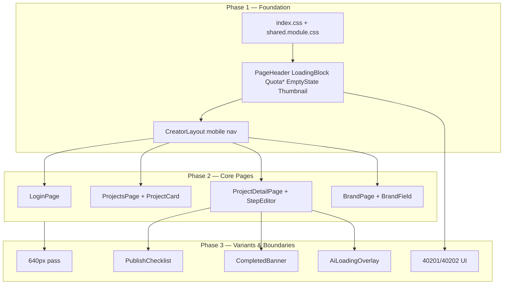

# 创作者工作台原型对齐 UI Polish

## Summary

在不改变 Creator API 契约与业务行为的前提下，按 origin 规定的 **shell/token → 核心四页 → 变体态/边界态** 顺序，扩展 `creator/` 共享样式与组件层，逐页对齐 `creator/docs/prototypes/` 8 张参考图及 README 边界态；无后端支撑的装饰（缩略图、ETA、忘记密码）用占位或省略处理。(see origin: docs/brainstorms/2026-05-25-creator-prototype-fidelity-polish-requirements.md)

---

## Problem Frame

Creator MVP 功能完整，但 UI 与 2026-05-25 高保真原型在布局、组件形态与边界态上差距明显；零散改 CSS 会导致顶栏/步骤条/卡片不一致。Polish 为验证招募前的「可评审第一印象」，不扩展产品能力。(see origin Problem Frame)

---

## Requirements

- R1–R3. 设计 token、共享组件、交付顺序（shell → 四页 → 变体/边界）
- R4–R8. 登录、项目列表（含空态）、详情/长图文、品牌档案
- R9–R11. 发布核对、完成态变体自动呈现
- R12–R14. 配额用尽、AI loading、移动端 ≤640px
- R15–R16. API 不变；无后端装饰元素占位/省略
- AE1–AE5. 空态、配额、AI loading、窄屏、API 回归

**Origin actors:** A1（多平台个人创作者）, A2（产品/设计内部验收）

**Origin flows:** F1（核心页面浏览与操作）, F2（边界态触达）

**Origin acceptance examples:** AE1（R5 空态）, AE2（R12 配额）, AE3（R13 AI loading）, AE4（R14/R16 窄屏与占位）, AE5（R15 API 回归）

---

## Scope Boundaries

- 新流水线、新 API、AI prompt 改版、支付集成
- 验证招募与访谈执行（`docs/creator-validation-playbook.md` 运营不在本期）
- Admin / 运维扩展；像素级 1:1 复刻
- 为对齐原型新增后端字段或图片上传
- 原型背景中的未定义页面（数据看板、素材库等 mock 导航）

### Deferred to Follow-Up Work

- Playwright 视觉回归 CI 门禁（验证期前非必须；见 Open Questions）
- `/ce-compound` 沉淀 creator 专属 UI learnings（polish 完成后可选）

---

## Context & Research

### Relevant Code and Patterns

- `creator/src/index.css` — 已有暗色 token（`--bg #0c0f14`、`--accent #f2b84b`、`--success #4ade80`）、DM Sans、`animateIn`
- `creator/src/styles/shared.module.css` — 按钮/表单/panel/badge；缺 `.page`、`.loading`、`.notice`、`.btnSecondary`
- `creator/src/layouts/CreatorLayout.tsx` — 顶栏 + 配额条 + 导航；720px 部分 wrap
- `creator/src/components/StepProgress.tsx` — 7 步圆形进度；需对齐原型层级与窄屏
- `creator/src/pages/*` — 业务逻辑集中在页面；`ProjectDetailPage.tsx` ~273 行含 publish/complete/history
- `creator/src/api/client.ts` — `ApiError` 含 `code`/`status`；配额错误 `40201`（AI）、`40202`（完成项目）来自 `app/services/creator_usage.py`
- `admin/src/components/PageHeader.tsx`、`LoadingBlock.tsx` — 页面骨架范本（视觉 token 不同）
- `creator/docs/prototypes/*.png` + `README.md` — 唯一 UI 验收参考

### Institutional Learnings

- `docs/solutions/ui-bugs/admin-modal-offscreen-transform-containing-block-2026-05-19.md` — 祖先 `transform`（含 `fadeUp`/`animateIn`）会使 fixed overlay 错位；新增 overlay 须 portal 到 `document.body` 或避免在动画容器内 fixed
- `docs/solutions/integration-issues/admin-caddy-path-without-trailing-slash-2026-05-18.md` — `/creator` vs `/creator/` 已对称处理；polish 后 smoke test 两个 URL

### External References

- 无额外外部研究；本地 admin/creator 模式已足够

---

## Key Technical Decisions

- **组件提取策略：** 页面保留 TanStack Query / mutation 编排；纯 markup 与重复 UI 下沉 `creator/src/components/`，样式优先 `shared.module.css` + 组件 module
- **忘记密码：** 完全省略（无后端）；不展示禁用链，避免 dead-end UX (origin deferred → resolved)
- **项目卡片缩略图：** `PipelineThumbnail` 按 `pipeline_id`（`short_video` / `long_article`）渲染 CSS 渐变或内联 SVG 占位，不请求后端 (R16)
- **详情页 ETA 日期：** 省略；不对齐 mock 中的装饰日期
- **品牌页侧栏：** 不落地原型中的多级「品牌中心」侧栏；保留顶栏「项目 / 品牌档案」导航 (origin Key Decisions)
- **配额 UI：** `QuotaDisplay` 从 Layout 拆出；mutation 捕获 `ApiError.code === 40201|40202` 映射 `QuotaLimitNotice`；顶栏进度条在 ≥90% 或满额时切换 warn 样式
- **AI loading：** `AiLoadingOverlay` 覆盖步骤编辑 panel（opacity + spinner + `aria-busy`），不仅改按钮文案 (R13)
- **移动端 ≤640px：** 顶栏采用汉堡按钮 + 抽屉/下拉展开 nav + 折叠 quota；步骤条横向 scroll 保留但增大触控目标；表单与 CTA 纵向 stack (R14)
- **弹层：** 若 polish 需 drawer/modal，新建 `Modal.tsx` 使用 `createPortal(..., document.body)`（mirror admin 模式）
- **前端测试：** 不引入 vitest/playwright 于本期；回归 = API pytest + 人工原型对照 + `npm run build && tsc -b`

---

## Open Questions

### Resolved During Planning

- **共享组件清单：** 见 U1–U2 与 Output Structure
- **视觉回归 CI：** 推迟至验证期后可选 follow-up

### Deferred to Implementation

- 汉堡菜单抽屉 vs 纯 stack 顶栏的最终视觉细节（以 640px 截图验收为准）
- `PipelineThumbnail` 渐变配色微调（实现时对照原型卡片色调）

---

## Output Structure

```
creator/src/
├── index.css                          # 补 quota-warn 等 token（U1）
├── styles/shared.module.css           # 扩展 primitive（U1）
├── components/
│   ├── PageHeader.tsx                 # U1
│   ├── LoadingBlock.tsx               # U1
│   ├── QuotaDisplay.tsx               # U1
│   ├── QuotaLimitNotice.tsx           # U1
│   ├── EmptyState.tsx                 # U1
│   ├── PipelineThumbnail.tsx          # U1
│   ├── PlatformPicker.tsx             # U4
│   ├── ProjectCard.tsx                # U4
│   ├── StepEditorPanel.tsx            # U5
│   ├── AiLoadingOverlay.tsx           # U5
│   ├── PublishChecklist.tsx           # U6
│   ├── CompletedBanner.tsx            # U6
│   ├── ConfirmedStepsHistory.tsx      # U6
│   ├── BrandField.tsx                 # U3
│   ├── StepProgress.tsx               # 已有，U5 polish
│   └── ProtectedRoute.tsx             # U2 改用 LoadingBlock
├── layouts/CreatorLayout.tsx          # U2
└── pages/
    ├── LoginPage.tsx                  # U3
    ├── ProjectsPage.tsx               # U4
    ├── ProjectDetailPage.tsx          # U5–U6 瘦身
    └── BrandPage.tsx                  # U3
```

---

## High-Level Technical Design

> *This illustrates the intended approach and is directional guidance for review, not implementation specification. The implementing agent should treat it as context, not code to reproduce.*



**数据流不变：** 页面仍通过 `api/creator.ts` 调用既有端点；polish 仅改变 presentation 与 error mapping。

---

## Implementation Units

- U1. **Design tokens & shared primitives**

**Goal:** 建立可复用设计基础，供后续各页消费 (R1, R2)

**Requirements:** R1, R2, AE5（不破坏构建）

**Dependencies:** None

**Files:**
- Modify: `creator/src/index.css`, `creator/src/styles/shared.module.css`
- Create: `creator/src/components/PageHeader.tsx`, `PageHeader.module.css`
- Create: `creator/src/components/LoadingBlock.tsx`（可仅 composes shared）
- Create: `creator/src/components/QuotaDisplay.tsx`, `QuotaDisplay.module.css`
- Create: `creator/src/components/QuotaLimitNotice.tsx`, `QuotaLimitNotice.module.css`
- Create: `creator/src/components/EmptyState.tsx`, `EmptyState.module.css`
- Create: `creator/src/components/PipelineThumbnail.tsx`, `PipelineThumbnail.module.css`

**Approach:**
- 在 `:root` 补充 `--warn`、`--quota-high` 等变量（配额近满/用尽）
- `shared.module.css` 增加 `.page`（统一入场动画）、`.loading`/`.spinner`、`.notice`、`.btnSecondary`、`.muted`
- `QuotaLimitNotice` 接受 `kind: 'ai' | 'projects'` 与可选 `plan` 文案（Pro 升级提示为静态文案，链向无支付则仅说明联系/脚本提升）
- `EmptyState` 支持 icon/标题/描述/可选 children（指向表单的视觉引导）
- `PipelineThumbnail` 纯 CSS/SVG，props: `pipelineId`

**Patterns to follow:**
- `admin/src/components/PageHeader.tsx`, `LoadingBlock.tsx`
- `creator/src/styles/shared.module.css` composes 链

**Test scenarios:**
- Test expectation: none — 纯 UI primitive；由页面级人工验收与 U7 API 回归覆盖

**Verification:**
- `cd creator && npm run build && npx tsc -b` 通过
- Storybook 无；可临时在 `ProjectsPage` 引用 `EmptyState` 验证编译

---

- U2. **Shell polish & responsive header**

**Goal:** 顶栏、配额、导航对齐原型；640px 可用 (R2, R14)

**Requirements:** R2, R14, F1

**Dependencies:** U1

**Files:**
- Modify: `creator/src/layouts/CreatorLayout.tsx`, `CreatorLayout.module.css`
- Modify: `creator/src/components/ProtectedRoute.tsx`（使用 `LoadingBlock`）

**Approach:**
- `CreatorLayout` 改用 `QuotaDisplay`；满额/近满样式
- ≤640px：汉堡 toggle → 展开 nav links + quota + email/logout stack
- 保持 `NAV` 常量仅「项目」「品牌档案」；不添加 mock 导航项
- `main` max-width 与原型对齐（可略宽于当前 880px 若原型暗示更宽列表区）

**Patterns to follow:**
- `admin/src/layouts/AdminLayout.tsx` 结构（顶栏版）
- `CreatorLayout.module.css` 现有 720px media query 扩展至 640px

**Test scenarios:**
- Test expectation: none — layout/styling；窄屏人工验收 (AE4)

**Verification:**
- 320px / 640px / 1280px 视口下顶栏可导航、quota 可读、无横向溢出

---

- U3. **Login & Brand pages**

**Goal:** 对齐 `prototype-login.png` 与 `prototype-brand.png` (R4, R8)

**Requirements:** R4, R8, F1

**Dependencies:** U1

**Files:**
- Modify: `creator/src/pages/LoginPage.tsx`, `LoginPage.module.css`
- Modify: `creator/src/pages/BrandPage.tsx`, `BrandPage.module.css`
- Create: `creator/src/components/BrandField.tsx`, `BrandField.module.css`

**Approach:**
- **Login：** 强化左右分栏层级；表单 card 阴影/圆角；邮箱/密码输入可加 leading icon（CSS 或 inline SVG）；注册切换改为底部 link 样式（保留现有 mode state）；**不**添加忘记密码
- **Brand：** 四字段各用 `BrandField`（label、hint、textarea、`0/300` 字数）；底部保存说明文案对齐原型；字段卡片式背景

**Patterns to follow:**
- 现有 `LoginPage` 已有 login/register 切换逻辑，保留行为

**Test scenarios:**
- Test expectation: none — styling；品牌保存仍走既有 API

**Verification:**
- 对照两张原型截图；注册/登录/保存品牌功能与 polish 前一致

---

- U4. **Projects list & empty state**

**Goal:** 对齐 `prototype-projects.png` 与 `prototype-projects-empty.png` (R5, R16, AE1)

**Requirements:** R5, R16, AE1, F1

**Dependencies:** U1, U2

**Files:**
- Modify: `creator/src/pages/ProjectsPage.tsx`, `ProjectsPage.module.css`
- Create: `creator/src/components/ProjectCard.tsx`, `ProjectCard.module.css`
- Create: `creator/src/components/PlatformPicker.tsx`, `PlatformPicker.module.css`

**Approach:**
- 提取 `PlatformPicker`（现有 pill toggle 逻辑）
- `ProjectCard`：标题、状态 badge、流水线标签、步骤 fraction、进度条百分比文字、`PipelineThumbnail` 占位、右 chevron
- 空列表：`EmptyState` 引导至上方新建表单（AE1）
- 新建表单 panel 布局对齐原型（字段顺序、平台区、主 CTA）

**Patterns to follow:**
- `ProjectsPage.tsx` 现有 `createMut` / `PLATFORMS` 常量

**Test scenarios:**
- Covers AE1. Happy path: 0 项目 → 显示 EmptyState 非单行 muted
- Edge case: 创建失败仍显示 `shared.error` 或 `QuotaLimitNotice`（为 U6 预留）

**Verification:**
- 有项目/无项目两态对照原型；创建项目导航至详情仍正常

---

- U5. **Project detail core, StepProgress & AI loading**

**Goal:** 对齐 `prototype-project-detail.png` 与 `prototype-long-article.png` 代表步骤；增强 AI loading (R6, R7, R13, AE3)

**Requirements:** R6, R7, R13, AE3, F1

**Dependencies:** U1, U2

**Files:**
- Modify: `creator/src/pages/ProjectDetailPage.tsx`, `ProjectDetailPage.module.css`
- Modify: `creator/src/components/StepProgress.tsx`, `StepProgress.module.css`
- Create: `creator/src/components/StepEditorPanel.tsx`, `StepEditorPanel.module.css`
- Create: `creator/src/components/AiLoadingOverlay.tsx`, `AiLoadingOverlay.module.css`

**Approach:**
- `StepProgress`：对齐原型圆形步骤、done/active 态、标签截断；窄屏 scroll
- 详情 hero：流水线标签、状态、步骤 hint；**省略** ETA 装饰
- `StepEditorPanel`：步骤 title/description、textarea、按钮行（暂存/AI/确认）
- `AiLoadingOverlay`：包裹 panel，`aiMut.isPending` 时显示；portal 或避免 animateIn 祖先 fixed 问题
- 长图文验收：确保 `long_article` 流水线正文步骤（如 `body` step_key）在同一 panel 结构下视觉对齐 `prototype-long-article.png`

**Patterns to follow:**
- 现有 `confirmMut` / `aiMut` / `draftMut` 保留在 `ProjectDetailPage`

**Test scenarios:**
- Covers AE3. Happy path: 点击 AI 建议 → overlay 可见 → 完成后可编辑
- Edge case: AI 失败 → overlay 消失 + 错误展示

**Verification:**
- 短视频 step 2、长图文正文步各手动走查；步骤确认仍即时刷新（现有 fix 行为保持）

---

- U6. **Publish, completed variants & quota wiring**

**Goal:** 对齐 `prototype-publish-checklist.png`、`prototype-project-completed.png`；配额专用 UI (R9–R12, R11, AE2)

**Requirements:** R9, R10, R11, R12, AE2, F2

**Dependencies:** U1, U5

**Files:**
- Modify: `creator/src/pages/ProjectDetailPage.tsx`
- Create: `creator/src/components/PublishChecklist.tsx`, `PublishChecklist.module.css`
- Create: `creator/src/components/CompletedBanner.tsx`, `CompletedBanner.module.css`
- Create: `creator/src/components/ConfirmedStepsHistory.tsx`, `ConfirmedStepsHistory.module.css`
- Modify: `creator/src/pages/ProjectsPage.tsx`（create 错误映射，若 U4 未做）

**Approach:**
- 从 `ProjectDetailPage` 拆出 publish / completed / history 区块
- `PublishChecklist`：按平台分组展示项、完成项目 CTA 区
- `CompletedBanner` + `ConfirmedStepsHistory`：完成态对齐原型
- 在 `completeMut`、`aiMut`、`createMut`（及必要时 `confirmMut`）的 `onError` 中检测 `40201`/`40202` → 渲染 `QuotaLimitNotice`
- `QuotaDisplay` 满额时顶栏同步 warn 态

**Patterns to follow:**
- `app/services/creator_usage.py` 错误码
- 现有 checklist toggle / complete 逻辑不变

**Test scenarios:**
- Covers AE2. Integration: 模拟或测试账号触达完成项目上限 → 完成项目操作显示 QuotaLimitNotice 非裸 message
- Happy path: publish 步 checklist 勾选 → 完成项目 → 完成态 banner

**Verification:**
- 对照 publish/completed 原型；`uv run pytest tests/api/test_creator*.py -v` 全绿 (AE5)

---

- U7. **Mobile pass, docs & acceptance checklist**

**Goal:** 640px 全站可用；文档化已知差异；可交付 A2 验收 (R14–R16, R3, Success Criteria)

**Requirements:** R3, R14, R15, R16, AE4, AE5, Success Criteria

**Dependencies:** U2–U6

**Files:**
- Modify: `creator/src/pages/*.module.css`（查漏补缺 responsive）
- Modify: `creator/FRONTEND.md`（扩展为 mirror admin 规范 + creator token/组件清单）
- Modify: `creator/docs/prototypes/README.md`（增加「实现已知差异」小节）

**Approach:**
- 640px 走查四页 + 变体/边界态，修复 overflow、触控目标、步骤条
- `FRONTEND.md` 记录：token 表、组件目录、原型验收路径、禁止硬编码色值
- README 列出：无缩略图上传、无 ETA、无忘记密码、无品牌侧栏 — 与 R16 一致

**Patterns to follow:**
- `admin/FRONTEND.md` 结构

**Test scenarios:**
- Covers AE4. 640px 详情页无致命横向滚动；卡片为占位缩略图
- Covers AE5. `uv run pytest tests/api/test_creator*.py -v` 全绿
- Happy path: `cd creator && npm run build && npx tsc -b`

**Verification:**
- A2 可按 README 清单逐项勾选 8 原型 + 边界态
- Caddy smoke: `curl -sk -o /dev/null -w "%{http_code}\n" https://localhost/creator/`

---

## System-Wide Impact

- **Interaction graph:** 仅 `creator/` SPA；无 API/router 变更
- **Error propagation:** `ApiError.code` 40201/40202 在 UI 层映射；其他错误仍用 `shared.error`
- **State lifecycle risks:** AI overlay 须在 mutation settle 后清除，避免卡死
- **API surface parity:** 无
- **Integration coverage:** Creator API pytest 套件证明后端契约未破坏
- **Unchanged invariants:** 全部 `/api/v1/creator/*` 与 auth 行为；配额计数规则；流水线步骤 keys

---

## Risks & Dependencies

| Risk | Mitigation |
|------|------------|
| `animateIn`/`transform` 导致 overlay 错位 | `AiLoadingOverlay` portal 或 relative 遮罩；见 admin modal learning |
| 组件过度抽象 | 仅提取 2+ 页复用或单页 >40 行 markup 块 |
| 原型与实现「对齐」主观 | README 已知差异清单 + A2 勾选表 |
| Polish 拖慢验证招募 | U1–U2 先交付可演示 shell；U4–U6 优先高频路径 |

---

## Documentation / Operational Notes

- 更新 `creator/FRONTEND.md`（U7）
- 可选：polish 完成后 `/ce-compound` 记录 creator UI 模式
- 验证期前不要求 Playwright CI

---

## Suggested Delivery Order

```
U1 → U2 ─┐
         ├→ U3, U4 (可并行)
U1 ──────┘
U5 ← U1, U2
U6 ← U5
U7 ← U2–U6
```

推荐 PR 切分：**(1) U1–U2 基础 (2) U3–U4 列表/认证 (3) U5–U6 详情变体 (4) U7 文档与 mobile pass**

---

## Sources & References

- **Origin document:** docs/brainstorms/2026-05-25-creator-prototype-fidelity-polish-requirements.md
- Prototypes: `creator/docs/prototypes/`
- Prior MVP plan: `docs/plans/2026-05-22-001-feat-creator-ai-workflow-hub-plan.md`
- Admin patterns: `admin/FRONTEND.md`, `admin/src/components/PageHeader.tsx`
- Learnings: `docs/solutions/ui-bugs/admin-modal-offscreen-transform-containing-block-2026-05-19.md`
