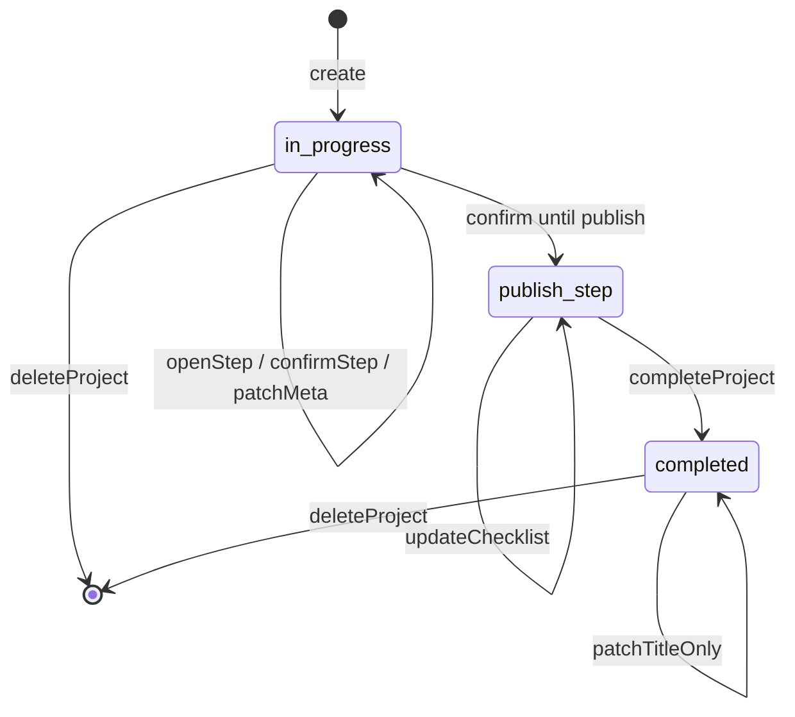

# 创作者工作台 MVP 功能补全

## Summary

分两波补齐 Creator C 端 MVP 缺口：**第一波**在后端扩展项目 CRUD、步骤回退导航、发布进度聚合与 AI 上下文修正，并在 `creator/` 暴露删除/编辑、可点击步骤条、完整版本历史与发布摘要；**第二波**在 `app/api/v1/auth/*` 增加改密与邮件找回密码，并新增账号设置页。不改动配额规则、流水线定义与自动发帖边界。**已于 2026-05-25 落地**（U1–U7）。(see origin: `docs/brainstorms/2026-05-25-creator-mvp-functional-gaps-requirements.md`)

---

## Problem Frame

Origin 指出 C 端「太简陋」：缺删除/改元数据、步骤只能前进、版本看不全、发布 checklist 无「部分已发」感知、账号无自助改密/找回。后端已有 `project_step_artifacts` 多版本与 `publish_checklist_state`，但 API/UI 未完整暴露。(see origin Problem Frame)

---

## Requirements

**第一波（R1–R11）**
- R1. 删除自己的项目（硬删除 + 确认）
- R2. 修改项目标题（进行中/已完成均可）
- R3. 修改目标平台（仅发布步骤之前）
- R4–R5. 回退到已确认步骤查看/编辑，再确认产生新版本
- R6. 已完成项目保持只读（不回退编辑）
- R7–R8. 按步骤分组展示完整版本历史
- R9–R11. 发布步骤按平台聚合 checklist，列表/详情展示发布进度摘要

**第二波（R12–R15）**
- R12–R13. 账号设置页 + 登录后改密（校验当前密码）
- R14–R15. 忘记密码邮件重置；SMTP 未就绪时登录页说明 + Admin 兜底

**Origin actors:** A1 多平台创作者；A2 产品/运营（验证期 Admin 兜底密码）

**Origin flows:** F1 项目生命周期；F2 回退与版本；F3 发布进度；F4 账号自助

**Origin acceptance examples:** AE1→R1；AE2/AE3→R3；AE4→R4–R5；AE5→R7；AE6→R9–R10；AE7→R13；AE8→R14

---

## Scope Boundaries

- 支付/Pro 订阅、新流水线、自动发帖、数据看板
- 已完成项目全量解锁编辑、软删除/回收站、版本一键恢复
- 修改邮箱、2FA、OAuth
- 像素级 UI polish（见 `docs/plans/2026-05-25-001-feat-creator-prototype-fidelity-polish-plan.md`，可并行）

**与 polish 计划的文件边界：** 本计划已改 `ProjectDetailPage`、`ProjectCard`、`StepProgress` 等；polish 计划应仅做视觉/token 对齐，**避免**再改 API 契约或生命周期逻辑。UX 缺口（40020 中文映射、平台变更 confirm、复制按钮）归 polish 或 follow-up。

### Deferred to Follow-Up Work

- **Refresh token 全局吊销**（改密后旧 refresh 立即失效）：验证期可接受「返回新 token 对 + 短 access 过期」；公测前再加 `users.token_version` 或 Redis 黑名单
- **Mailpit / SMTP Compose profile**：第二波实施时若本地无 stub，文档说明用 Admin 重置

---

## Context & Research

### Relevant Code and Patterns（as-built，2026-05-25）

- 项目生命周期：`PATCH/DELETE /api/v1/creator/projects/{id}`；`update_project` / `delete_project` / `open_step`
- Artifact：`get_latest` / `list_latest_by_step`；`gather_confirmed_context` 仅拼接每步最新 version
- 发布进度：`summarize_publish_progress` → `ProjectOut.publish_progress`（仅 publish 步且未 completed）
- Auth：`POST /auth/change-password`、`/forgot-password`、`/reset-password`；Redis token + SMTP（未配置 → 50301）
- 前端：`StepVersionHistory.tsx`、`AccountPage` / `ForgotPasswordPage` / `ResetPasswordPage`；`StepProgress` 可点击回退
- 测试：`tests/api/test_creator_projects.py`、`test_creator_publish.py`、`test_auth_password.py`

### Institutional Learnings

- （无 `docs/solutions/` 中 Creator 缺口相关条目）

### External References

- 不引入外部研究；本仓 Creator MVP 计划 `docs/plans/2026-05-22-001-feat-creator-ai-workflow-hub-plan.md` 为分层与测试模式参考

---

## Key Technical Decisions

| 决策 | 理由 |
|------|------|
| **回退 = `POST .../steps/{step_key}/open`**，将 `current_step_key` 设为该步，并把最新 artifact 内容写入 `draft_content[step_key]` | 复用现有 draft/confirm 路径；最小 schema 变更 (see origin R4–R5) |
| **`open` 仅允许已有 artifact 的步骤**（已确认步），或当前步；不允许跳到未确认的未来步 | 防止跳过必填步骤 |
| **从中间步 re-confirm 后仍 `next_step_key` 前进**；不删除后续已确认 artifact | 符合 origin「不强制作废后续步骤」 |
| **`gather_confirmed_context` / `_to_out` 展示逻辑使用每步最新 version** | 满足 R5 AI 上下文；修复现有多版本重复拼接隐患 |
| **删除项目：硬 DELETE**；events 行保留、`project_id` 置 NULL | Origin R1 + 现有 FK；R11 聚合指标不丢 |
| **`PATCH /projects/{id}`** 单 endpoint：`title` + 可选 `target_platform_keys`；平台变更时 **清空** `publish_checklist_state` | 避免旧平台 checklist 残留 |
| **发布进度：服务端 helper + `ProjectOut.publish_progress` 可选字段** | 列表接口 `include_artifacts=False` 时也能展示摘要 (R10) |
| **平台「已发」判定：该平台下 checklist 项全部 checked**；部分 checked = 进行中；零 checked = 未发 | Origin R9 |
| **第二波改密：`POST /auth/change-password`**，成功返回新 `TokenPair` | 无 token_version 列时的最小安全增量 |
| **忘记密码：Redis 存 token（email→token 或 token→user_id），TTL 1h，Celery 或 BackgroundTasks 发邮件** | 仓库无 SMTP；需新增 Settings + 可选 dev stub |
| **SMTP 未配置时 forgot-password 返回 503 + 明确 code**；登录页静态说明联系 Admin | Origin R15 |
| **AppException 40020–40022 与 creator_ai 既有码段重叠** | ~~实现已交付但前端无法按 code 区分~~ → **已拆分**：project 用 **40023/40024**，AI 保留 40020/40021 |

---

## Open Questions

### Resolved During Planning

- **回退后能否从中间步 confirm 到更后步？** 仅允许 confirm **当前** `current_step_key`；用户 open 某步 → 编辑 → confirm → 自动 next，可连续操作回到 publish，不提供「跳步 confirm」。
- **删除是否清 creator_events？** 否，依赖 DB `ON DELETE SET NULL`。
- **已完成项目改标题？** 允许 PATCH title；其余写操作只读 (R6)。
- **StepVersionHistory UI？** 采用 `
` 分组 accordion（见 U5）；不采用侧栏 drawer。
- **忘记密码未知邮箱？** 无论是否存在账号，均返回 HTTP 200 + 统一 `MessageOut`（防枚举）。
- **Redis 重置 token 结构？** `password_reset:token:{token}` → `user_id`，TTL 可配置。

### Deferred to Implementation

- 邮件 HTML 模板文案与发件人 display name
- 是否在 compose 加 Mailpit service（第二波 U7 实施时决定）
- **测试补强**（实现已交付，以下仍建议补测）：U2 AI 上下文集成测试；U1 completed 仅改 title；checklist PATCH 全量 replace 语义；列表 `publish_progress`

---

## High-Level Technical Design

> *Directional guidance for review, not implementation specification.*

**发布进度聚合（示意）**

| 平台 | 条件 | 状态 |
|------|------|------|
| 每目标平台 | 0/N 项 checked | 未发 |
| 每目标平台 | 1..N-1 项 checked | 进行中 |
| 每目标平台 | N/N 项 checked | 已发 |

**项目级摘要：** `platforms_published / platforms_total`；若存在「进行中」且无「已发」→ 文案「发布核对中」；若部分平台已发 →「部分已发（x/y 平台）」。

---

## Phased Delivery

### Phase 1 — 工作台核心（U1–U5）

后端 API + Creator 前端；合并后即可验证招募（origin Success Criteria）。

### Phase 2 — 账号能力（U6–U7）

Auth 扩展 + 账号设置页 + 登录忘记密码；可与 Phase 1 并行开发，独立 PR 合并。

---

## Implementation Units

### Phase 1

- U1. **Backend: project lifecycle API**

**Goal:** 支持删除项目、更新标题与目标平台（含校验）。

**Requirements:** R1, R2, R3；F1；AE1, AE2, AE3

**Dependencies:** None

**Files:**
- Modify: `app/schemas/creator.py`（`ProjectUpdate`）
- Modify: `app/services/creator_project.py`（`update_project`, `delete_project`）
- Modify: `app/repositories/creator_project.py`（`delete`）
- Modify: `app/api/v1/creator/projects.py`（`PATCH`, `DELETE`）
- Test: `tests/api/test_creator_projects.py`

**Approach:**
- `update_project`: completed 仅允许 `title`；`in_progress` 且 `current_step_key != "publish"` 允许改 `target_platform_keys`；进入 publish 后拒绝改平台 (40020)
- 平台变更时重置 `publish_checklist_state={}`
- `delete_project`: 校验 ownership 后 `session.delete`；记录可选 event `project.deleted`（无 project_id 或 payload 含 id）

**Patterns to follow:**
- 现有 `AppException` code 序列 40010–40019
- `tests/api/creator_helpers.py` 工厂方法

**Test scenarios:**
- Happy path: PATCH title 成功；PATCH platforms 在 hook 步成功且 checklist 模板变长
- Edge case: Covers AE3. PATCH platforms 在 publish 步 → HTTP 400 + **code 40020**
- Happy path: Covers AE1. DELETE 后 GET 404、list 不含
- Edge case: DELETE 他人项目 → 404
- Error path: PATCH 空 title → 422

**Verification:**
- `tests/api/test_creator_projects.py` 新增用例全绿；现有 Creator API 测试无回归

---

- U2. **Backend: step open & latest-artifact semantics**

**Goal:** 支持回退打开已确认步骤；AI/展示只用每步最新 artifact。

**Requirements:** R4, R5, R6；F2；AE4

**Dependencies:** None（可与 U1 并行，合并前无冲突）

**Files:**
- Modify: `app/repositories/creator_artifact.py`（`list_latest_by_step`, `get_latest`）
- Modify: `app/services/creator_project.py`（`open_step`, 修 `gather_confirmed_context`）
- Modify: `app/api/v1/creator/projects.py`（`POST .../open`）
- Modify: `app/services/creator_ai.py`（若直接调用 context helper，确认走最新版）
- Test: `tests/api/test_creator_projects.py`, `tests/api/test_creator_ai.py`

**Approach:**
- `open_step`: `_ensure_editable`；目标步须有 artifact；设 `current_step_key`，draft 预填最新 content
- `save_draft` / `confirm_step` 保持「仅 current 步」规则 — open 后自然满足
- re-confirm 走现有 `next_version` + `next_step_key`
- `gather_confirmed_context`: 按 step 顺序只拼接 latest artifact

**Test scenarios:**
- Covers AE4. confirm topic → hook → open topic → edit → confirm → topic artifact v2，hook 仍为 v1
- Integration: AI suggest 在 hook 步上下文不含 topic v1 旧内容（仅 v2）— **测试未写，见 Deferred / Implementation Gaps**
- Error path: open 未确认步 → 400；completed 项目 open → 40018
- Error path: open publish 步（无 artifact）→ 400

**Verification:**
- 多版本 + AI 上下文测试通过；40012 仍对「未 open 就跨步 confirm」生效

---

- U3. **Backend: publish progress in API**

**Goal:** 服务端计算平台级发布进度并暴露给列表/详情。

**Requirements:** R9, R10, R11；F3；AE6

**Dependencies:** U1（平台列表可能 PATCH，逻辑独立）

**Files:**
- Modify: `app/creator/checklists.py`（`summarize_publish_progress`）
- Modify: `app/schemas/creator.py`（`PublishProgressOut`, 挂到 `ProjectOut`）
- Modify: `app/services/creator_project.py`（`_to_out` 填充 progress）
- Test: `tests/api/test_creator_publish.py`

**Approach:**
- 输入：`target_platforms`, `publish_checklist_state`, `current_step_key`
- 仅当 `current_step_key == "publish"` 且 `status != completed` 时填充非 null progress；completed 可用「已完成」或省略
- 返回：`platforms_total`, `platforms_published`, `summary_label`（中文）
- **checklist PATCH 语义：** 请求体为**全量 replace**（非 merge）；取消勾选须显式传 `checked: false` 项

**Test scenarios:**
- Covers AE6. 两平台，小红书全勾、公众号未勾 → `platforms_published=1`, summary 含「部分」
- Edge case: 非 publish 步 → `publish_progress=null`
- Edge case: checklist 全勾但未 complete_project → 仍 in_progress，summary 显示全部平台已发

**Verification:**
- publish 相关 API 测试通过；`complete` 与 quota 行为不变

---

- U4. **Frontend: project lifecycle UI**

**Goal:** 列表/详情可编辑标题、平台（受规则限制）与删除项目。

**Requirements:** R1, R2, R3；F1

**Dependencies:** U1

**Files:**
- Modify: `creator/src/api/creator.ts`
- Modify: `creator/src/types/api.ts`
- Modify: `creator/src/pages/ProjectsPage.tsx`
- Modify: `creator/src/pages/ProjectDetailPage.tsx`
- Modify: `creator/src/components/ProjectCard.tsx`（可选 kebab 菜单）
- Create: `creator/src/components/ProjectActionsMenu.tsx` + `.module.css`（若需要）

**Implementation note:** 未创建 `ProjectActionsMenu`；删除入口内联于 `ProjectCard` 与详情页 toolbar。

**Approach:**
- 删除：confirm dialog → `deleteProject` → invalidate queries → navigate `/`
- 编辑标题：inline 或 modal → `updateProject`
- 编辑平台：仅详情页展示 `PlatformPicker`，publish 步隐藏并 tooltip 说明
- ApiError code 40020 展示友好文案 — **未实现**（码段冲突时更难映射；见 Implementation Gaps）

**Test scenarios:**
- Test expectation: none — 行为由 API 测试覆盖；手动走查删除/改标题/改平台

**Verification:**
- creator-dev 下完成删/改流程；配额与创建流程无回归

---

- U5. **Frontend: step navigation, version history, publish badges**

**Goal:** 可点击步骤条回退、完整版本历史、发布进度展示。

**Requirements:** R4, R7, R8, R10；F2, F3

**Dependencies:** U2, U3, U4

**Files:**
- Modify: `creator/src/api/creator.ts`（`openStep`）
- Modify: `creator/src/components/StepProgress.tsx` + `.module.css`（可点击 done 步）
- Create: `creator/src/components/StepVersionHistory.tsx` + `.module.css`
- Modify: `creator/src/pages/ProjectDetailPage.tsx`
- Modify: `creator/src/components/ProjectCard.tsx`
- Modify: `creator/src/lib/labels.ts`
- Deprecate usage: `ConfirmedStepsHistory.tsx` — **仍存在于仓库，详情页已改用 StepVersionHistory；删除见 Implementation Gaps**

**Approach:**
- StepProgress: `onStepOpen(stepKey)`；仅 `done` 步可点；当前步不重复 open
- StepVersionHistory: 按 `step_key` group artifacts；`
` 展示全文（**复制按钮未实现**，见 Implementation gaps）
- ProjectCard / Detail header: 当 `publish_progress` 存在时显示 badge（复用 `shared.badgeProgress` 或新 token）
- open 后刷新 project query，editor 显示 draft

**Test scenarios:**
- Test expectation: none — UI 手动验收对照 origin AE4–AE6

**Verification:**
- 短视频流水线：回退改 hook → 看 v1/v2 历史 → 列表见部分已发摘要

---

### Phase 2

- U6. **Backend: password change & email reset**

**Goal:** C 端改密与忘记密码邮件流；SMTP 缺失时明确降级。

**Requirements:** R13, R14, R15；F4；AE7, AE8

**Dependencies:** None（与 Phase 1 独立）

**Files:**
- Modify: `app/core/config.py`（`smtp_*`, `password_reset_expire_minutes`, `app_public_url`）
- Modify: `.env.example`
- Create: `app/services/email.py`（或 `app/core/email.py`）
- Modify: `app/services/auth.py`（`change_password`, `request_password_reset`, `reset_password`）
- Modify: `app/schemas/auth.py`
- Modify: `app/api/v1/auth.py`
- Test: `tests/api/test_auth_password.py`（新建）

**Approach:**
- `change_password`: 校验 current + new → update hash → 返回新 TokenPair（当前密码错误 → **40106**）
- `forgot-password`: 限流（email 级 Redis，超限 **42902**）；生成 token 存 Redis；若 SMTP 配置则发含 `{app_public_url}/creator/reset-password?token=` 的邮件；无 SMTP → 503 + code 50301；**未知邮箱亦返回 200 + 统一 MessageOut**
- `reset-password`: 校验 token → 更新密码 → 删 token（无效/过期 → **40022**）
- 验证期文档：`docs/creator-validation-playbook.md` 增补 Admin 兜底说明
- **安全注记：** reset token 经 URL query 传递，可能进入 Referer/日志；验证期可接受，公测前考虑 POST body 或 one-time fragment

**Execution note:** 先写 `tests/api/test_auth_password.py` 失败用例，再实现 auth service。

**Test scenarios:**
- Covers AE7. change-password 成功后旧密码 login 失败、新密码成功
- Covers AE8. forgot → reset token → new password login（SMTP mock/patch）
- Error path: forgot 未知邮箱 → 200 统一文案（防枚举）
- Error path: SMTP 未配置 forgot → 503
- Error path: reset 过期 token → 400 + **code 40022**

**Verification:**
- 新 auth 测试全绿；现有 login/register 无回归

---

- U7. **Frontend: account settings & forgot password**

**Goal:** 账号设置页、顶栏入口、登录页忘记密码与重置页。

**Requirements:** R12, R13, R14, R15；F4；AE7, AE8

**Dependencies:** U6

**Files:**
- Modify: `creator/src/api/client.ts` 或新建 `creator/src/api/auth.ts`
- Create: `creator/src/pages/AccountPage.tsx` + `.module.css`
- Create: `creator/src/pages/ForgotPasswordPage.tsx`, `ResetPasswordPage.tsx`
- Modify: `creator/src/pages/LoginPage.tsx`
- Modify: `creator/src/layouts/CreatorLayout.tsx`
- Modify: `creator/src/App.tsx`（routes `/account`, `/forgot-password`, `/reset-password`）

**Approach:**
- AccountPage: 展示 email（`/auth/me`）；改密表单 → change-password → 更新 AuthContext tokens
- LoginPage: 「忘记密码」链到 `/forgot-password`；503 时展示 playbook 中的 Admin 兜底说明
- ResetPasswordPage: 读 query `token`，提交新密码

**Test scenarios:**
- Test expectation: none — 手动走查改密与 reset 链接

**Verification:**
- 本地 SMTP stub 或 mock 下端到端 reset；无 SMTP 时 UI 展示兜底文案

---

## System-Wide Impact

- **Interaction graph:** `CreatorProjectService._to_out` 被 list/get/confirm 等多处调用 — publish_progress 计算须 O(platforms×items)，保持纯函数
- **Error propagation:** AppException code **40020**（AI 非当前步）、**40021**（AI 未启用）、**40023**（改平台被拒）、**40024**（open 未确认步）、**40022**（无效 reset token）、**40106**（改密当前密码错误）、**42902**（忘记密码限流）、**50301**（SMTP 未配置）
- **State lifecycle risks:** 平台 PATCH 清空 checklist — UI 需 confirm；open_step 与 draft 竞态靠 React Query invalidate
- **API surface parity:** 仅 creator + auth；admin 不受影响
- **Integration coverage:** U2 AI 上下文 + U3 列表 progress 需跨 endpoint 集成测试
- **Unchanged invariants:** quota complete 判定、pipeline 步骤序、brand profile、402 限额

---

## Risks & Dependencies

| Risk | Mitigation |
|------|------------|
| 回退后用户困惑「后续步仍显示已确认」 | UI 版本历史标明最新版；origin 已接受不自动作废 |
| 中间步 re-confirm 后下游 artifact 内容可能陈旧 | 产品已接受；用户可再次 open 后续步编辑 |
| `gather_confirmed_context` 漏改导致 AI 用旧版 | U2 集成测试 + code review |
| SMTP 阻塞第二波上线 | R15 Admin 兜底 + 503 明确错误 |
| 删除项目后 metrics 仍计数 | events SET NULL 保留；admin metrics 按 event_type 仍有效 |
| Reset token 在 URL query 泄露 | 短 TTL + 一次性消费；公测前改 fragment/body |

---

## Documentation / Operational Notes

- 更新 `.env.example`：`SMTP_HOST`, `SMTP_PORT`, `SMTP_USER`, `SMTP_PASSWORD`, `SMTP_FROM`, `APP_PUBLIC_URL`
- 更新 `docs/creator-validation-playbook.md`：密码兜底流程
- 可选：`AGENTS.md` creator 小节补「账号设置 / 忘记密码」入口说明

---

## Implementation Gaps（doc review 2026-05-25，follow-up 2026-05-25）

| 优先级 | 缺口 | 状态 |
|--------|------|------|
| P1 | **40020/40021 跨域复用** | ✅ 已拆分为 40023/40024（project） |
| P1 | 改密/重置后 **旧 refresh token 仍有效** | 仍 defer（Follow-Up Work） |
| P2 | U2 **AI 上下文集成测试** | ✅ `test_ai_context_uses_latest_artifact_after_reconfirm` |
| P2 | 中间步 re-confirm 后 **下游 artifact 语义可能陈旧** | 产品接受；未改代码 |
| P2 | checklist PATCH **全量 replace** | ✅ 测试 `test_publish_checklist_replace_clears_unchecked` |
| P2 | completed **仅改 title** / 列表 **publish_progress** | ✅ 已补测 |
| P3 | `ConfirmedStepsHistory.tsx` dead code | ✅ 已删除 |
| P3 | U5 **复制按钮**、U4 **40023 中文映射**、平台变更 **confirm** | ✅ 前端已补 |

---

## Sources & References

- **Origin document:** [docs/brainstorms/2026-05-25-creator-mvp-functional-gaps-requirements.md](../brainstorms/2026-05-25-creator-mvp-functional-gaps-requirements.md)
- Prior plan: [docs/plans/2026-05-22-001-feat-creator-ai-workflow-hub-plan.md](2026-05-22-001-feat-creator-ai-workflow-hub-plan.md)
- Code: `app/services/creator_project.py`, `app/creator/checklists.py`, `creator/src/pages/ProjectDetailPage.tsx`
