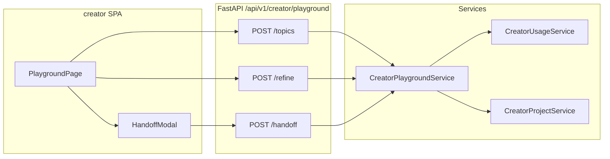

# Creator 选题 Playground（灵感实验室）

## Summary

在 Creator 工作台新增 **灵感实验室** Playground：面向「完全空白」用户，生成 5–10 条选题清单，支持多轮 refine，满意后 handoff 创建流水线项目并注入预填草稿。Playground 使用 **独立于步骤 ai-suggest** 的月度额度。后端新增 `/api/v1/creator/playground/*`；前端新增 `/playground` 路由与顶栏入口。(see origin: `docs/brainstorms/2026-06-25-creator-topic-playground-requirements.md`)

---

## Problem Frame

现有 `CreatorAiService.suggest` 绑定 `current_step_key`，用户在决定「做什么」之前无法在系统内发散。Origin 要求 Playground 与流水线执行分离，handoff 时打包上下文。(see origin Problem Frame)

---

## Requirements Trace

| ID | 计划单元 | 说明 |
|----|----------|------|
| R1, R2 | U5 | 顶栏入口 + 空白态页 |
| R3, R4 | U2, U3 | 首次生成选题清单 + 品牌档案 |
| R5, R6 | U3, U6 | 多轮 refine + 换选选题 |
| R7, R8, R8a | U4, U7 | handoff 选 pipeline + 映射注入 |
| R9, R10, R10a | U1, U5 | 独立 Playground 额度 + UI 展示 |
| R11, R12 | U6 | sessionStorage 会话 + 用户隔离 |
| R13 | U3 | LLM 错误重试 UX |
| AE1–AE3 | 各单元测试 | 见 Test scenarios |
| SC1–SC4 | U8, U9 | 埋点与 metrics |

---

## Scope Boundaries

**In scope**
- Playground API（generate topics / refine / handoff）
- 用量计数扩展（`playground_calls` 或等价字段）
- `creator/` 新页面、导航、handoff 模态
- Alembic 迁移、API 测试

**Deferred**
- 服务端会话持久化（v1.1）
- URL 抓取、趋势 chip、模板 Fork（见 origin Deferred）

---

## Key Technical Decisions

| 决策 | 理由 |
|------|------|
| v1 **无服务端 Playground 会话表**；会话状态在前端 sessionStorage，LLM 上下文随请求提交 | 满足 R11；降低 v1 迁移复杂度；handoff 一次性提交完整 payload |
| 新增 **`playground_calls`** 列于 `creator_usage_counters`（非复用 `ai_calls`） | 满足 R9 独立计量；与现有 `CreatorUsageService` 模式一致 |
| 默认额度 env：`CREATOR_FREE_PLAYGROUND_CALLS_PER_MONTH`（建议 30），Pro 倍率沿用 `creator_pro_multiplier` | 与 R10 商业化对称；数值可 env 覆盖 |
| Playground prompt 放 **`app/creator/prompts/playground.py`** | 与步骤 prompt 分离；便于 iterate |
| **generate** 返回结构化 JSON（5–10 topics）；**refine** 接收 messages[] + selected_topic | 多轮对话；LlmClient 可要求 JSON mode 或 parse fence |
| **handoff** 由 `CreatorPlaygroundService.handoff_to_project` 调用 `CreatorProjectService.create` + 写 `draft_content` | 复用现有项目模型；映射表集中在一处 |
| 映射 v1：**topic 步** ← title + brief；**hook 步**（若 refine 提取到）← hooks 文本；其余步空 | 满足 R8a 最低标准；长图文/短视频共用 topic/hook key |
| 事件：`playground.session_started`, `playground.handoff` 写入 `creator_events` | SC4 追踪 |

---

## Open Questions

### Resolved During Planning

- **会话存储：** sessionStorage per-tab + 刷新丢失提示 + 导出 JSON（R11）。
- **Pipeline 默认：** 无历史时不预选（R7）。
- **品牌为空：** 允许生成 + 质量警示（R4）。

### Deferred to Implementation

- refine 超过 N 轮时的 **上下文摘要压缩**（token 成本控制）。
- 移动端 ≤768px 布局细节（单列 + 全屏 refine）。

---

## High-Level Technical Design



---

## Implementation Units

### U1 — 用量计量扩展

**Goal:** Playground 独立月度额度检查与递增。

**Files**
- Modify: `app/models/creator.py`（`CreatorUsageCounter.playground_calls`）
- Modify: `app/schemas/creator.py`（`UsageOut` 增字段）
- Modify: `app/services/creator_usage.py`（`check_playground_quota`, `increment_playground`）
- Modify: `app/core/config.py`（`creator_free_playground_calls_per_month`）
- Create: `alembic/versions/*_add_playground_calls.py`

**Approach:** 镜像 `ai_calls` 模式；402 业务码新设 `40203`。

**Test scenarios**
- 免费用户 playground 达上限后 `POST /playground/topics` 返回 402
- Pro 用户倍率生效
- `GET /usage` 返回 playground 已用/上限

**Verification:** `uv run pytest tests/api/test_creator_playground.py -k quota`

---

### U2 — Playground Prompt 模板

**Goal:** generate 与 refine 的系统/用户 prompt。

**Files**
- Create: `app/creator/prompts/playground.py`
- Modify: `app/creator/prompts/__init__.py`（export）

**Approach:**
- `build_topics_prompt(brand, optional_seed)` → 要求 JSON `{ "topics": [{ "title", "reason" }] }`，5–10 条
- `build_refine_prompt(brand, selected_topic, messages[])` → assistant 回复 + 更新 `current_understanding`
- 注入 brand taboos；空品牌时在 user prompt 标注

**Test scenarios**
- 单元测试：prompt 含 brand 字段与 adjustment
- Mock LLM：parse 合法 JSON topics

**Verification:** `uv run pytest tests/unit/test_playground_prompts.py`

---

### U3 — Playground API + Service

**Goal:** 三个端点实现 generate / refine /（handoff 在 U4）。

**Files**
- Create: `app/services/creator_playground.py`
- Create: `app/api/v1/creator/playground.py`
- Modify: `app/api/v1/creator/router.py`（include）
- Modify: `app/schemas/creator.py`（`PlaygroundTopicsOut`, `PlaygroundRefineIn/Out`）

**Endpoints**
| Method | Path | 行为 |
|--------|------|------|
| POST | `/playground/topics` | 检查 playground 配额 → LLM 生成 topics → increment |
| POST | `/playground/refine` | body: `{ selected_topic, messages[] }` → LLM 回复 → increment |

**Approach:** `CreatorPlaygroundService` 依赖 `CreatorBrandService`, `CreatorUsageService`, `LlmClient`；错误时 `AppException` + 可重试文案（R13）。

**Test scenarios**
- AE1：登录用户 topics 返回 5–10 条
- refine 第二轮携带 messages 历史
- LLM 未配置时 503/明确错误
- 未登录 401

**Verification:** `uv run pytest tests/api/test_creator_playground.py`

---

### U4 — Handoff 创建项目

**Goal:** 将 Playground 上下文注入新项目草稿。

**Files**
- Extend: `app/services/creator_playground.py`（`handoff_to_project`）
- Modify: `app/schemas/creator.py`（`PlaygroundHandoffIn`, `PlaygroundHandoffOut`）
- Extend: `app/api/v1/creator/playground.py`（`POST /handoff`）

**HandoffIn:** `{ pipeline_id, title, brief, hooks?: string, raw_notes?: string }`

**Mapping（v1）**
| Playground 字段 | 项目 `draft_content` key |
|-----------------|--------------------------|
| title + brief | `topic`（合并为 Markdown 段落） |
| hooks | `hook`（若 pipeline 含 hook 步） |
| raw_notes | 附加在 topic 末尾注释块 |

**Approach:** 调用 `CreatorProjectService.create` 后 patch `draft_content`；返回 `project_id`；记录 `playground.handoff` 事件。

**Test scenarios**
- AE2：handoff 后 GET project topic draft 非空
- 两种 pipeline_id 均可用
- 映射预览字段与写入一致

**Verification:** `uv run pytest tests/api/test_creator_playground.py -k handoff`

---

### U5 — 前端导航 + Playground 页骨架

**Goal:** R1 入口、R2 空白态、R10a 额度展示。

**Files**
- Modify: `creator/src/layouts/CreatorLayout.tsx`（NAV 增 `/playground`「灵感实验室」）
- Modify: `creator/src/components/QuotaDisplay.tsx`（展示 playground 额度）
- Create: `creator/src/pages/PlaygroundPage.tsx`
- Create: `creator/src/pages/PlaygroundPage.module.css`
- Modify: `creator/src/App.tsx`（route）
- Modify: `creator/src/api/creator.ts`（API client）
- Modify: `creator/src/types/api.ts`

**Approach:** 空白态 + 主 CTA「帮我找选题」；顶栏 quota 分开展示 Playground / 步骤 AI。

**Test scenarios:** 手动：顶栏可见入口；空态文案；402 展示 QuotaLimitNotice 变体

**Verification:** `make creator-dev` 目视 + 现有 e2e 若有则补

---

### U6 — 选题卡片 + Refine 会话 UI

**Goal:** R3–R6、R11 sessionStorage。

**Files**
- Create: `creator/src/components/PlaygroundTopicCards.tsx`
- Create: `creator/src/components/PlaygroundRefinePanel.tsx`
- Create: `creator/src/hooks/usePlaygroundSession.ts`（sessionStorage 读写 + 导出 JSON）
- Extend: `PlaygroundPage.tsx`

**Approach:**
- 卡片 grid 展示 title/reason；选中高亮
- Refine：消息列表 + 输入框；换选时 confirm 重置
- 刷新警告条（R11）

**Test scenarios:** 手动 AE1/AE3；换选确认；导出 JSON

---

### U7 — Handoff 模态

**Goal:** R7–R8 映射预览与确认。

**Files**
- Create: `creator/src/components/PlaygroundHandoffModal.tsx`
- Extend: `PlaygroundPage.tsx`

**Approach:** pipeline 单选（无历史不预选）；只读映射预览；可编辑 textarea；确认调用 `/handoff` → navigate `/projects/:id`

**Test scenarios:** 手动 AE2 全路径

---

### U8 — API 自动化测试

**Goal:** 覆盖 AE1–AE3 与配额。

**Files**
- Create: `tests/api/test_creator_playground.py`

**Approach:** 复用 `tests/api/test_creator_projects.py` fixture 模式；mock LLM 返回固定 JSON。

---

### U9 — 埋点（可选，小）

**Goal:** SC4 metrics。

**Files**
- Modify: `app/services/creator_events.py`（helper）
- Call sites in U3/U4

**Event types:** `playground.topics_generated`, `playground.handoff`

---

## Sequencing

1. **U1** 计量（后续依赖）
2. **U2 + U3** 后端 API（可并行 prompt）
3. **U4** handoff
4. **U8** 测试锁定行为
5. **U5 → U6 → U7** 前端纵向切片
6. **U9** 埋点

---

## Risks & Dependencies

| 风险 | 缓解 |
|------|------|
| LLM JSON 解析失败 | retry + fallback regex extract；前端友好错误 |
| 多轮 refine token 膨胀 | v1 限制 messages 长度；Outstanding：摘要压缩 |
| handoff 映射不满足 SC2 | U4 单元测试 + R8a 最低标准 |
| 刷新丢会话 | sessionStorage + 警告 + 导出 |

**Dependencies:** `LLM_API_KEY` 配置；现有 `CreatorProjectService.create`；Caddy 无需改（SPA 路由已有 try_files）。

---

## Verification Checklist

- [ ] `uv run alembic upgrade head`
- [ ] `uv run pytest tests/api/test_creator_playground.py -v`
- [ ] `uv run ruff check . && uv run mypy app`
- [ ] 本地 `make creator-dev`：Playground 全路径 → 项目 topic 非空
- [ ] `QuotaDisplay` 展示双额度

---

## Output Structure

```
app/
  api/v1/creator/playground.py          # new
  services/creator_playground.py        # new
  creator/prompts/playground.py         # new
  models/creator.py                     # playground_calls
  schemas/creator.py                    # extended
  services/creator_usage.py             # extended
creator/src/
  pages/PlaygroundPage.tsx              # new
  components/Playground*.tsx            # new
  hooks/usePlaygroundSession.ts         # new
tests/api/test_creator_playground.py    # new
docs/plans/2026-06-25-003-feat-creator-topic-playground-plan.md
```
