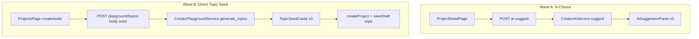

# Creator 灵感 Sprint — N-Choice 多方案 AI + 项目页 Direct Topic Seed

## Summary

分两波交付创作者工作台「灵感获取」增强：**Wave A** 将步骤内 `ai-suggest` 从单条建议扩展为 **3 方案并排对比（N-Choice Panel）**；**Wave B** 在项目创建区增加 **Direct Topic Seed**（输入方向 → 生成 3 个标题候选 → 创建项目并预填选题步）。两波均不改变流水线定义、配额数值配置、自动发帖边界；Wave A 计 **步骤 AI 额度**，Wave B 计 **Playground 额度**。(see origin: `docs/ideation/2026-06-25-creator-inspiration-ideation.html` ideas #1, #2 变体)

---

## Problem Frame

**N-Choice：** 产品已在 topic/hook 步提供「再给 3 个角度」adjustment chip，但 UX 仍是串行「换一版」——用户无法并排对比，且多次 regenerate 消耗配额、挫败感高。`CreatorAiService.suggest` 与 `AiSuggestionPanel` 仅支持单一 `suggestion` 字符串。

**Direct Topic Seed：** Playground 服务「完全空白」用户；项目页创建表单仍要求用户自行拟定标题。后端 `CreatorPlaygroundService.generate_topics` 与 `build_topics_prompt` **已支持可选 `seed`**，但 API 未暴露 body，前端项目页也未接入——存在「有方向、想快开」的路径缺口。

---

## Requirements Trace

| ID | 来源 | 计划单元 | 说明 |
|----|------|----------|------|
| R-N1 | ideation #1 | U1–U4 | 一次 AI 调用返回 3 个可对比方案 |
| R-N2 | ideation #1 | U1, U3 | 1 次调用计 1 次步骤 AI 额度 |
| R-N3 | ideation #1 | U4 | 移动端可浏览 3 方案（swipe 或 tab） |
| R-D1 | 对话 + Playground R8a | U5–U8 | 项目页输入方向 → 3 标题候选 → 创建 + 选题步非空 |
| R-D2 | Playground R9 | U5, U6 | Direct Seed 走 Playground 额度 |
| R-D3 | Playground R4 | U6 | 品牌为空时仍可生成 + 质量警示 |
| AE-N1 | 推导 | U1–U4 测试 | topic 步生成 → 3 卡 → 采纳 → 配额 +1 |
| AE-D1 | Playground AE2 变体 | U7–U8 测试 | 选标题 → create → GET project topic draft 非空 |

---

## Scope Boundaries

**In scope**
- Wave A：`AiSuggestOut` 扩展、`CreatorAiService` 多方案 prompt/parse、`AiSuggestionPanel` 多卡 UI
- Wave B：`POST /playground/topics` 接受 body `{ seed? }`（后端 service 已有）、项目页 seed 流程 + handoff 式 draft 注入（复用 `_build_topic_draft`）
- API 测试 + 前端类型更新

**Deferred for later**（见 origin / MVP gaps）
- 版本一键恢复、已完成项目解锁编辑
- 灵感采样库、Mise en Place、Remix 画廊
- Playground 服务端会话持久化
- Pro 支付、自动发帖、趋势 API

**Outside this product's identity**
- 自动发布、平台 OAuth、通用 AI 聊天
- 替换 ChatGPT / 剪映等主力工具

**Deferred to Follow-Up Work**
- Wave B 可选：选中标题后 inline refine 1 轮（当前 v1 仅 seed → 3 选 → create）
- N-Choice 在 script 等长文步骤启用（v1 仅 topic + hook）

---

## Key Technical Decisions

| 决策 | 理由 |
|------|------|
| **Wave A 优先于 Wave B** | 改动面更小、无新路由；ideation 置信度最高；直接改善流水线内 AI UX |
| N-Choice **一次 LLM 调用** 返回 JSON `{"variants":[{"label","content"},...]}`（恰好 3 条） | 比 3 次并行调用省 latency 与成本；配额计 1 次 |
| v1 N-Choice **仅 topic + hook 步**启用多方案；其他步保持单条 `suggestion` | 长文步三卡并排价值低、移动端负担大；可通过 `step_key in MULTI_VARIANT_STEPS` 门控 |
| `AiSuggestOut` 保留 `suggestion` 字段（= `variants[0].content`） | 向后兼容现有测试与旧前端；新前端读 `variants` |
| 解析失败时 **fallback 单条**：整段 LLM 输出作为唯一 suggestion | 避免 503 阻断创作；记录 parse 失败可后续 metrics |
| Direct Seed **复用 Playground topics API + 额度**，不新增 `topic-seed` 端点 | `generate_topics(user, seed)` 与 `build_topics_prompt(brand, seed)` 已存在；仅暴露 schema + 前端 |
| Direct Seed 返回 **3 条**（从 5–10 条中 UI 展示前 3 或 prompt 约束「精简模式 3 条」） | 项目页侧栏空间有限；实现选：**prompt 分支** `seed` 存在时要求恰好 3 条 |
| 创建项目：**createProject + saveDraft(topic)** 两步（或新增 `create_with_seed` 原子端点） | 复用现有 PATCH step；避免 handoff 强绑 pipeline 选择模态的完整 refine 流程 |
| Direct Seed v1 **不**强制 handoff 模态 | 用户已在项目页选好 pipeline/平台；映射仅 topic 步 |

---

## Open Questions

### Resolved During Planning

- **配额：** N-Choice = 1 ai_call；Direct Seed = 1 playground_call（与 Playground 首次生成一致）。
- **步骤范围：** N-Choice v1 = topic, hook（短视频）；长图文可加 outline 步，留 Wave A.1 可选。
- **API 兼容：** 保留 `suggestion` 主字段。

### Deferred to Implementation

- N-Choice prompt 多样性不足时是否自动 regenerate（不重试 v1）。
- Direct Seed 选中后是否自动填充「项目主题」input 为 title（建议：是）。

---

## High-Level Technical Design



---

## Implementation Units

### U1 — 多方案 prompt 与解析（Wave A 后端）

**Goal:** `CreatorAiService.suggest` 在 topic/hook 步返回 3 个结构化方案。

**Requirements:** R-N1, R-N2

**Dependencies:** 无

**Files**
- Create: `app/creator/prompts/multi_variant.py`（JSON 格式说明、`parse_variants_json`、步骤门控常量）
- Modify: `app/services/creator_ai.py`
- Modify: `app/schemas/creator.py`（`AiVariantOut`, `AiSuggestOut.variants`）
- Modify: `tests/api/test_creator_ai.py`

**Approach**
- 当 `step_key in ("topic", "hook")` 且 adjustment 不含「合并」类指令时，system prompt 要求输出 JSON：`{"variants":[{"label":"角度A","content":"..."}, ...]}` 共 3 条，label 简短区分维度（受众/结构/语气等）。
- `parse_variants_json` 失败 → fallback 单条 `{label: "建议", content: raw}`。
- 仍调用 `increment_ai` 一次。
- `AiSuggestOut`: `variants: list[AiVariantOut]` + `suggestion: str`（properties: first variant content）。

**Patterns to follow:** `app/creator/prompts/playground.py` 的 `parse_topics_json` 模式

**Test scenarios**
- Happy: mock LLM 返回合法 3-variant JSON → 200，`len(variants)==3`，`suggestion==variants[0].content`，`ai_calls==1`
- Happy: script 步 → 仍返回单条 variants 长度 1 或仅 suggestion（行为与现网一致）
- Edge: JSON 缺字段 → fallback 单条，200
- Error: 无 LLM key → 50301（不变）
- Error: 非 current step → 40020（不变）
- Integration: adjustment「再给 3 个角度」→ 仍走 multi-variant 分支

**Verification:** `uv run pytest tests/api/test_creator_ai.py -v`

---

### U2 — API 契约与 OpenAPI 稳定（Wave A）

**Goal:** 路由层透传新 schema，无行为变化。

**Requirements:** R-N1

**Dependencies:** U1

**Files**
- Modify: `app/api/v1/creator/ai.py`（response_model 自动跟随 schema）
- Modify: `creator/src/types/api.ts`

**Approach:** TypeScript 增加 `AiVariant`、`AiSuggestResponse.variants?: AiVariant[]`；`suggestion` 保持必填。

**Test scenarios**
- Test expectation: none — schema/types only; covered by U1 API tests + frontend compile

**Verification:** `uv run mypy app`；`make creator-check` 类型通过

---

### U3 — AiSuggestionPanel 多卡 UI（Wave A 前端）

**Goal:** topic/hook 步展示 3 卡并排，采纳/插入针对选中卡。

**Requirements:** R-N1, R-N3

**Dependencies:** U2

**Files**
- Modify: `creator/src/components/AiSuggestionPanel.tsx`
- Modify: `creator/src/components/AiSuggestionPanel.module.css`
- Modify: `creator/src/pages/ProjectDetailPage.tsx`

**Approach**
- Props: `variants: { label: string; content: string }[] | null`；若 `variants?.length > 1` 渲染 card grid。
- 选中态高亮；「采纳全部」「插入光标」针对 `selectedVariant`。
- 「换一版」→ 再次 `aiSuggest`，替换 variants。
- 移动端（`max-width: 768px`）：横向 scroll-snap 或 segmented control 切换 A/B/C。
- `ProjectDetailPage`: `aiSuggest` onSuccess 设 `variants` + `suggestion`；单条时沿用旧 UI。

**Patterns to follow:** `PlaygroundTopicCards` 卡片布局、`AiSuggestionPanel` 现有 adopt/insert 按钮行

**Test scenarios**
- Test expectation: none — UI 变更；手动验收清单见 Acceptance Examples

**Verification:** `make creator-dev` 本地走查 topic 步 3 卡 + 移动端窄屏

---

### U4 — N-Choice 配额与 copy 说明（Wave A 收尾）

**Goal:** 用户理解 1 次生成 = 3 方案 = 1 次 AI 额度。

**Requirements:** R-N2

**Dependencies:** U3

**Files**
- Modify: `creator/src/components/AiSuggestionPanel.tsx`（helper text）
- Modify: `creator/src/components/QuotaDisplay.tsx`（tooltip 可选一句）

**Approach:** 多卡模式下 panel 副标题：「本次生成包含 3 个角度，消耗 1 次 AI 额度」。

**Test scenarios**
- Test expectation: none — copy only

**Verification:** 视觉走查

---

### U5 — 暴露 Playground topics seed body（Wave B 后端）

**Goal:** `POST /playground/topics` 接受 `{ "seed": "..." }` 可选字段。

**Requirements:** R-D2

**Dependencies:** 无（可与 Wave A 并行）

**Files**
- Modify: `app/schemas/creator.py`（`PlaygroundTopicsIn`）
- Modify: `app/api/v1/creator/playground.py`
- Modify: `tests/api/test_creator_playground.py`

**Approach**
- `PlaygroundTopicsIn.seed: str | None = Field(default=None, max_length=500)`
- Router 传入 `generate_topics(user, body.seed)`
- 当 `seed` 非空：prompt 分支要求 **恰好 3 条** topic（`build_topics_prompt` 增加 mode 参数或 seed 分支文案）

**Test scenarios**
- Happy: POST body `{seed:"职场穿搭"}` → 200，3 条 topics，prompt 含 seed（monkeypatch 断言 user prompt）
- Happy: 无 body → 行为与现网 5–10 条一致
- Edge: seed 空字符串 → 等同无 seed
- Error: playground 额度用尽 → 40203

**Verification:** `uv run pytest tests/api/test_creator_playground.py -v`

---

### U6 — Direct Seed API 客户端（Wave B）

**Goal:** 前端可带 seed 调用 topics。

**Requirements:** R-D1, R-D2

**Dependencies:** U5

**Files**
- Modify: `creator/src/api/creator.ts`（`playgroundTopics({ seed?: string })`）
- Modify: `creator/src/types/api.ts`

**Approach:** POST body 可选 `{ seed }`；Playground 页调用保持不变（不传 seed）。

**Test scenarios**
- Test expectation: none — client wrapper; covered by U5 + U8

**Verification:** TypeScript build pass

---

### U7 — ProjectsPage Topic Seed 流程（Wave B 前端）

**Goal:** 创建区增加「只有方向、帮我起标题」路径。

**Requirements:** R-D1, R-D3

**Dependencies:** U6

**Files**
- Create: `creator/src/components/TopicSeedPanel.tsx`
- Create: `creator/src/components/TopicSeedPanel.module.css`
- Modify: `creator/src/pages/ProjectsPage.tsx`
- Modify: `creator/src/pages/ProjectsPage.module.css`

**Approach**
- 在「项目主题」input 下方增加 secondary 链接「只有方向？AI 帮你想标题」→ 展开 `TopicSeedPanel`。
- Panel：textarea seed（≤500 字）+ CTA「生成 3 个标题」→ 调用 `playgroundTopics({ seed })`。
- 展示 3 张卡片（复用 `PlaygroundTopicCards` 样式或精简版）；选中 → 填入 `title` state + 生成 `_build_topic_draft` 等价 brief 存 local state。
- `brand_empty` 时展示与 Playground 一致的质量警示 + 链到 `/brand`。
- 40203 → `QuotaLimitNotice kind="playground"`。

**Patterns to follow:** `PlaygroundPage` 空白态 + `PlaygroundTopicCards`、`QuotaLimitNotice`

**Test scenarios**
- Test expectation: none — UI；手动验收

**Verification:** 本地 seed → 3 卡 → 选标题 → title input 已填

---

### U8 — 创建时注入选题草稿（Wave B 收尾）

**Goal:** Direct Seed 选中标题后，创建项目并 topic 步有预填内容。

**Requirements:** R-D1, AE-D1

**Dependencies:** U7

**Files**
- Modify: `creator/src/pages/ProjectsPage.tsx`
- Modify: `creator/src/api/creator.ts`（可选 helper）
- Modify: `tests/api/test_creator_playground.py` 或 `tests/api/test_creator_projects.py`（集成：create + patch topic）

**Approach**
- `createMut.onSuccess` 后若存在 `topicDraft`：`saveDraft(project.id, "topic", topicDraft)` 再 navigate。
- `topicDraft` 格式对齐 `_build_topic_draft(title, reason, null)`：`# 标题\n\n理由`。
- 长图文 pipeline 同样写 `topic` key。

**Test scenarios**
- Covers AE-D1. Happy: seed topics → 选手选 → create short_video → GET project → `draft_content.topic` 非空且含 title
- Edge: 用户选手选后又改 title input → 以最终 create 时 title 重建 draft
- Error: create 成功 saveDraft 失败 → 仍进详情页但 toast 提示「选题草稿未写入，请手动保存」

**Verification:** `uv run pytest tests/api/test_creator_projects.py -k draft -v`（新增用例）

---

## Acceptance Examples

- **Covers AE-N1.** Given 用户在 topic 步点击生成，when LLM 返回 3 variants，then UI 展示 3 卡，采纳 B 后编辑器内容为 B，usage.ai_calls 仅 +1。
- **Covers AE-D1.** Given 用户在项目页输入 seed「初夏通勤」，when 生成并选中第 2 个标题并创建短视频项目，then 进入详情页 topic 编辑器含非空预填（标题 + 理由）。

---

## Risks & Dependencies

| 风险 | 缓解 |
|------|------|
| LLM 三方案雷同 | prompt 明确要求 label 维度互斥；v2 加 diversity check |
| JSON 解析失败率高 | fallback 单条 + 503 仅在 LLM 完全失败 |
| Direct Seed 与 Playground 抢额度 | copy 说明；项目页 CTA 标注「消耗 Playground 额度」 |
| 移动端三卡布局拥挤 | scroll-snap + 单卡 focus 模式 |

**Prerequisites:** 现有 Creator MVP、Playground、LLM mock 测试基建。

---

## Suggested Delivery Order

1. **PR1 — Wave A:** U1 → U2 → U3 → U4（`make check` + `make creator-check`）
2. **PR2 — Wave B:** U5 → U6 → U7 → U8（可部分与 PR1 并行开发，独立合并）

---

## Verification (full sprint)

```bash
make check
make creator-check
```

Manual:
- 短视频 topic/hook 步：3 卡并排 + 采纳 + 配额
- 项目页 Direct Seed：seed → 3 标题 → 创建 → topic 非空
- Playground 原流程不受影响（无 seed 仍 5–10 条）
