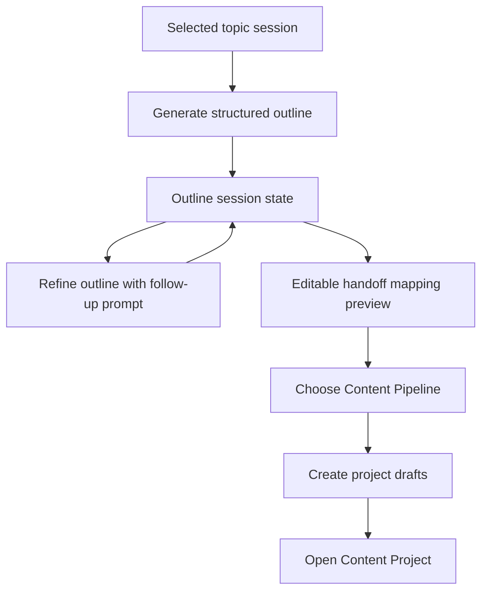

# feat: Add Creator Outline Lab

## Summary

Extend the existing Creator Inspiration Lab so a selected topic can become a Structured Outline, be refined in the same session, and hand off into a new Content Project with non-empty topic and outline context.

---

## Problem Frame

Inspiration Lab already owns pre-pipeline topic discovery and handoff. The current gap is the step between "this topic is promising" and "this content has a usable structure." Without an in-workbench outline artifact, creators can still fall back to external AI chats before the Content Pipeline begins.

This plan keeps Outline Lab inside the current Inspiration Lab surface. It does not introduce a new project type, persistent outline table, or general-purpose document editor.

---

## Requirements

**Outline generation and refinement**

- R1. A creator can generate a Structured Outline from the currently selected or refined topic before creating a Content Project. Origin: R1, R2, AE1.
- R2. The Structured Outline contains a central angle or claim, opening hook, 3-5 section or segment points, and closing CTA or takeaway. Origin: R2, AE1.
- R3. Outline generation and refinement use Brand Profile context when available and preserve the existing brand-empty warning path. Origin: R3.
- R4. Outline refinement preserves the current outline and selected topic through follow-up prompts in the same Inspiration Lab session. Origin: R4, R5, R6, AE2.
- R5. The creator can return from outline work to topic exploration without losing the selected topic in the current session. Origin: R7.

**Handoff and project creation**

- R6. Handoff happens after the creator approves the outline and chooses the target Content Pipeline. Origin: R8, AE3.
- R7. The handoff modal shows an editable mapping preview for topic and outline content before project creation. Origin: R9, R10, AE3.
- R8. A project created from Outline Lab opens with non-empty topic and outline context in the appropriate early pipeline steps. Origin: R11, AE4.

**Quota, session, and observability**

- R9. Outline generation and refinement consume Inspiration Lab quota, not in-pipeline AI quota. Origin: R12, AE5.
- R10. Quota exhaustion blocks new outline generation or refinement while preserving visible session content. Origin: R13, AE5.
- R11. Outline session state follows current Inspiration Lab session behavior, keeps the existing refresh-loss warning, and does not add server-side persistence in v1. Origin: R14.
- R12. Product validation can distinguish outline generation, outline refinement, outline handoff, and downstream project completion. Origin: SC4.

---

## Key Technical Decisions

- **Extend the existing playground API:** Add outline behavior to the current playground route/service/schema/prompt boundary so auth, quota checks, LLM errors, event recording, and response envelopes stay consistent.
- **Keep outline state client-session scoped:** Store the current outline and outline messages in the existing session hook. This matches the origin's v1 state boundary and avoids a migration before validation.
- **Use Structured Outline as a typed API artifact:** Parse LLM output into a structured response instead of storing only free-form assistant text. This gives the handoff preview and downstream tests stable fields to verify.
- **Map generic outline at handoff time:** Keep the lab outline pipeline-neutral, then map it into short-video `hook` or long-article `outline` draft content after the creator selects a pipeline.
- **Keep project-page topic seed lightweight:** Do not upgrade the project creation helper into full Outline Lab. That avoids a second outline UI and keeps the full flow in Inspiration Lab.

---

## High-Level Technical Design

The backend should keep topic generation, topic refinement, outline generation, outline refinement, and handoff as playground operations sharing the same quota bucket. The frontend should make outline generation a distinct step after topic selection, not a replacement for topic refine.

---

## Implementation Units

### U1. Backend Structured Outline contract and prompts

- **Goal:** Add typed outline request/response schemas, prompt builders, and parsing helpers for generation and refinement.
- **Requirements:** R1, R2, R3, R4, R9, R10.
- **Dependencies:** None.
- **Files:**
  - `app/schemas/creator.py`
  - `app/creator/prompts/playground.py`
  - `tests/api/test_creator_playground.py`
- **Approach:** Define a Structured Outline shape that carries the origin topic plus the required outline fields. Add prompt helpers that request JSON for initial outline generation and refinement, then parse and validate the LLM result into the schema.
- **Patterns to follow:** `parse_topics_json` and `extract_understanding` in `app/creator/prompts/playground.py`; LLM error handling in `CreatorPlaygroundService.generate_topics`.
- **Test scenarios:**
  - Covers AE1. Given a selected topic and configured LLM, outline generation returns all required outline fields.
  - Given an empty Brand Profile, outline generation succeeds and returns the same brand-empty warning semantics used by topic generation.
  - Given malformed LLM JSON, outline generation returns a controlled service error instead of a partial outline.
  - Given exhausted playground quota, outline generation is blocked with the playground quota business code.
- **Verification:** Backend outline prompt parsing is deterministic under mocked LLM responses and does not change existing topic generation tests.

### U2. Backend outline API and service flow

- **Goal:** Expose outline generation and outline refinement through the existing creator playground API boundary.
- **Requirements:** R1, R4, R9, R10, R12.
- **Dependencies:** U1.
- **Files:**
  - `app/api/v1/creator/playground.py`
  - `app/services/creator_playground.py`
  - `app/services/creator_events.py`
  - `app/schemas/creator.py`
  - `tests/api/test_creator_playground.py`
  - `tests/api/test_creator_events.py`
- **Approach:** Add service methods for outline generation and refinement that check playground quota before LLM calls, increment playground usage after success, and record outline-specific creator events (`playground.outline_generated`, `playground.outline_refined`). Keep routers thin and return `ApiResponse` envelopes.
- **Patterns to follow:** Existing `/playground/topics` and `/playground/refine` route/service split; `CreatorUsageService.check_playground_quota`; `CreatorEventService.record`.
- **Test scenarios:**
  - Covers AE2. Given an existing outline and user follow-up, refinement returns an updated outline while retaining the topic context.
  - Given a failed LLM provider request, playground usage is not incremented.
  - Given a successful outline generation, playground usage increments by one.
  - Given a successful outline refinement, playground usage increments by one.
  - Given outline generation and refinement events, event repository tests can count the new event types.
- **Verification:** API tests cover success, quota exhaustion, malformed LLM output, and usage increments without introducing new database schema.

### U3. Handoff mapping for Structured Outline

- **Goal:** Ensure approved outlines become non-empty project drafts for both supported Content Pipelines.
- **Requirements:** R6, R7, R8.
- **Dependencies:** U1, U2.
- **Files:**
  - `app/services/creator_playground.py`
  - `app/schemas/creator.py`
  - `tests/api/test_creator_playground.py`
- **Approach:** Extend handoff input so the frontend can submit an edited outline payload. Build topic draft content from the selected topic and map outline content into the early outline-bearing step for the selected pipeline. Also define project-entry behavior so the creator can see or reach the injected outline immediately after handoff: either show outline context in the first `topic` step, or allow preview/open of the prefilled outline-bearing step before it is marked done.
- **Patterns to follow:** `_build_topic_draft` and current `hook` / `outline` draft mapping in `CreatorPlaygroundService.handoff_to_project`; pipeline step lookup in `app/creator/pipelines.py`.
- **Test scenarios:**
  - Covers AE3. Given an edited outline payload, handoff accepts it and creates a project.
  - Covers AE4. Given `short_video`, the created project has non-empty `topic` and `hook` draft content.
  - Covers AE4. Given `long_article`, the created project has non-empty `topic` and `outline` draft content.
  - Manual/browser smoke: after handoff, the creator can see or open the injected outline context without first completing every earlier step manually.
  - Given multiple target platforms, handoff still requires a valid primary platform.
  - Given handoff without an outline payload, existing topic/refine handoff behavior remains valid if backwards compatibility is retained.
- **Verification:** Handoff tests prove both pipelines receive useful early-step context and existing project creation rules still apply.

### U4. Frontend session state and API client

- **Goal:** Add client types and session fields for current outline, outline messages, and outline loading/error state.
- **Requirements:** R1, R4, R5, R9, R10, R11.
- **Dependencies:** U1, U2.
- **Files:**
  - `creator/src/types/api.ts`
  - `creator/src/api/creator.ts`
  - `creator/src/hooks/usePlaygroundSession.ts`
  - `creator/src/pages/PlaygroundPage.tsx`
- **Approach:** Add typed API functions for outline generation/refinement. Extend session storage to preserve the selected topic, topic messages, current outline, and outline-refinement messages as separate state from topic refine. Reset outline state when the selected topic changes after confirmation, when regenerating a new topic batch after confirmation, but keep the selected topic when collapsing the outline workspace back to topic exploration.
- **Patterns to follow:** `playgroundTopics`, `playgroundRefine`, `usePlaygroundSession`, and quota handling in `PlaygroundPage`.
- **Test scenarios:**
  - Test expectation: none in automated frontend tests because `creator/` currently has no test harness.
  - Manual/browser smoke: selected topic persists while entering and leaving the outline panel.
  - Manual/browser smoke: switching topics warns before clearing outline state and outline refine messages.
  - Manual/browser smoke: regenerating topics warns before clearing outline state when an outline already exists.
  - Manual/browser smoke: quota exhaustion keeps the current outline visible while disabling new outline actions.
  - Manual/browser smoke: the existing refresh-loss warning remains visible while outline state is session-scoped.
- **Verification:** TypeScript build validates API types and session state shape; browser smoke validates state transitions.

### U5. Frontend Outline Lab UI

- **Goal:** Add the visible outline generation and refinement workspace within the existing Inspiration Lab page.
- **Requirements:** R1, R2, R3, R4, R5, R10, R11.
- **Dependencies:** U4.
- **Files:**
  - `creator/src/pages/PlaygroundPage.tsx`
  - `creator/src/pages/PlaygroundPage.module.css`
  - `creator/src/components/PlaygroundOutlinePanel.tsx`
  - `creator/src/components/PlaygroundOutlinePanel.module.css`
  - `creator/src/components/PlaygroundRefinePanel.tsx`
  - `creator/src/components/PlaygroundRefinePanel.module.css`
  - `creator/src/components/PlaygroundHandoffModal.tsx`
  - `creator/src/components/PlaygroundHandoffModal.module.css`
- **Approach:** Present outline generation as the next action after topic selection. Add a dedicated outline panel component instead of overloading topic refine UI. Show the selected topic beside the Structured Outline, render outline fields in a scannable AI-accented panel, and cover empty, generating, error, quota-blocked, and brand-empty states explicitly.
- **Patterns to follow:** Creator UI token guidance in `creator/FRONTEND.md`; AI surface treatment in `PlaygroundPage.module.css`; message composer behavior in `PlaygroundRefinePanel`.
- **Test scenarios:**
  - Manual/browser smoke: selected topic can generate an outline with all required sections visible.
  - Manual/browser smoke: brand-empty warning remains visible when topic or outline generation runs without profile context.
  - Manual/browser smoke: follow-up refinement updates the outline and appends the interaction to the session.
  - Manual/browser smoke: returning to topic exploration does not clear the selected topic.
  - Manual/browser smoke: loading and error states are visible for outline generation and refinement.
- **Verification:** `creator` lint/build passes and the page remains responsive on desktop and mobile Creator Workbench layouts.

### U6. Handoff preview and project entry flow

- **Goal:** Update the handoff modal so creators can review and edit the topic/outline mapping before project creation.
- **Requirements:** R6, R7, R8.
- **Dependencies:** U3, U4, U5.
- **Files:**
  - `creator/src/components/PlaygroundHandoffModal.tsx`
  - `creator/src/components/PlaygroundHandoffModal.module.css`
  - `creator/src/pages/PlaygroundPage.tsx`
  - `creator/src/api/creator.ts`
  - `creator/src/types/api.ts`
- **Approach:** Replace the current hook/angle-only preview with a mapping preview that distinguishes topic content from outline content and explains pipeline-specific destinations (`topic`, `hook`, or `outline`). Keep pipeline selection in the modal, allow the edited payload to be submitted to handoff, and preserve modal state on recoverable handoff errors.
- **Patterns to follow:** Existing `PlaygroundHandoffModal` pipeline selection and platform picker; `PlatformPicker` primary-platform handling.
- **Test scenarios:**
  - Covers AE3. Manual/browser smoke: handoff preview shows topic and outline destinations before submit.
  - Covers AE3. Manual/browser smoke: edited outline text is what gets submitted.
  - Covers AE4. Manual/browser smoke: after successful handoff, navigation opens the created project detail page.
  - Manual/browser smoke: modal remains usable on mobile; if fixed positioning breaks under page transforms, use a portal.
- **Verification:** TypeScript build catches payload drift; API tests from U3 prove submitted payload reaches project drafts.

### U7. Validation events and metrics coverage

- **Goal:** Record enough creator events to measure outline generation, refinement, outline handoff, and downstream completion.
- **Requirements:** R12.
- **Dependencies:** U2, U3.
- **Files:**
  - `app/services/creator_events.py`
  - `app/repositories/creator_event.py`
  - `app/schemas/creator.py`
  - `app/api/v1/admin/creator_metrics.py`
  - `tests/api/test_creator_events.py`
- **Approach:** Extend admin metrics and event queries so SC4 can be measured without ad hoc SQL. U2 owns event emission; U7 owns counting outline generation/refinement/handoff events by type and correlating `playground.handoff` projects with later `project.completed` events by `project_id` or an explicit outline-origin marker in event payload.
- **Patterns to follow:** `playground.topics_generated`, `playground.handoff`, `project.created`, and `project.completed` event recording.
- **Test scenarios:**
  - Given outline generation succeeds, a `playground.outline_generated` event is recorded.
  - Given outline refinement succeeds, a `playground.outline_refined` event is recorded.
  - Given handoff uses an outline payload, handoff event payload records that outline context was included.
  - Given a project created from outline handoff later completes, metrics can compute outline handoff-to-completion rate from correlated events.
- **Verification:** Event tests show SC4 has queryable signals without changing creator user-facing flows.

---

## Scope Boundaries

### Deferred to Follow-Up Work

- Server-side outline draft persistence across refreshes or devices.
- Version diff or side-by-side comparison for outline revisions.
- Pipeline-specific outline variants before handoff.
- Upgrading the project-page topic seed helper into full outline generation.
- Saved outline templates, works library, batch outline generation, and content calendar.

### Outside Product Identity

- Automatic publishing or platform API integration.
- General-purpose document editing inside Inspiration Lab.
- User-defined infinite workflows or custom pipeline builders.
- Replacing the fixed Content Pipeline with open-ended chat.

---

## System-Wide Impact

- **Data model:** No new table or Alembic migration is planned for v1; outline state lives in the browser session until handoff.
- **Quota:** The feature increases use of `playground_calls`, not `ai_calls`; quota copy should continue to say "灵感实验室" or equivalent.
- **Prompt context:** Brand Profile and selected topic become load-bearing prompt inputs for outline generation and refinement.
- **Observability:** New outline events are needed for validation metrics, while downstream project completion remains measured through existing project events.
- **Frontend quality:** `creator/` currently relies on lint/build and manual smoke rather than a component test harness.

---

## Risks & Dependencies

- **LLM output shape risk:** Structured outline parsing can fail if prompts are too loose. Tests should cover malformed JSON and missing fields.
- **Session complexity risk:** Topic messages and outline messages can conflict if stored as one conversation. Keep outline state separate from topic refine state.
- **Handoff ambiguity risk:** A generic outline must map differently into short-video and long-article pipelines. Tests must cover both.
- **Modal layout risk:** A more complex handoff modal may expose fixed-position layout issues under transformed ancestors. Use a portal if the existing modal becomes unreliable.
- **Validation assumption:** The need for outline refinement is a product hypothesis from the origin doc; implementation should make usage measurable.

---

## Acceptance Examples

- AE1. Given a creator has selected a topic in Inspiration Lab, when they generate an outline, then the UI displays a Structured Outline with the required sections.
- AE2. Given an outline exists, when the creator asks for a refinement, then the current outline updates without clearing the selected topic.
- AE3. Given the creator opens handoff, when they choose a pipeline, then they see and can edit the topic and outline mapping before creating the project.
- AE4. Given the creator confirms handoff, when the project detail page opens, then the early project draft is not blank and contains topic plus outline context.
- AE5. Given playground quota is exhausted, when the creator attempts outline generation or refinement, then the new action is blocked and the current outline remains visible.

---

## Documentation / Operational Notes

- Update `CONCEPTS.md` only if implementation changes the meaning of `Structured Outline`; the current glossary entry already covers the planned concept.
- No new environment variables are expected.
- No external web research shaped this plan because the feature extends established local patterns rather than selecting a new library or provider.

---

## Sources / Research

- `docs/brainstorms/2026-06-29-creator-outline-lab-requirements.md`
- `CONCEPTS.md`
- `docs/brainstorms/2026-06-25-creator-topic-playground-requirements.md`
- `docs/brainstorms/2026-05-22-creator-ai-workflow-hub-requirements.md`
- `creator/FRONTEND.md`
- `app/services/creator_playground.py`
- `app/api/v1/creator/playground.py`
- `app/schemas/creator.py`
- `app/creator/prompts/playground.py`
- `creator/src/pages/PlaygroundPage.tsx`
- `creator/src/hooks/usePlaygroundSession.ts`
- `creator/src/components/PlaygroundHandoffModal.tsx`
- `tests/api/test_creator_playground.py`
- `docs/solutions/design-patterns/creator-workspace-ui-redesign-studio-sidebar.md`
- `docs/solutions/design-patterns/creator-workbench-icon-system-stage-pipeline.md`
- `docs/solutions/architecture-patterns/fastapi-production-scaffold-greenfield-2026-05-16.md`
