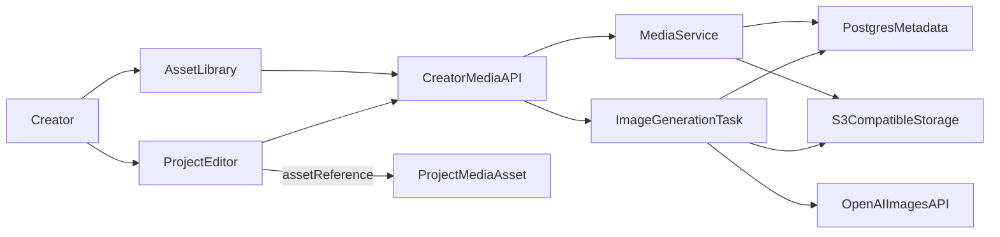

# 创作者图片素材库 - Plan

## Goal Capsule

为创作者工作台提供可跨项目复用的图片素材库：上传、URL 导入、OpenAI 图像生成、检索和受控预览，并让内容编辑器通过稳定引用关联素材。首期不含视频、协作审批、复杂图片编辑、恢复和公开 CDN 发布。

## Product Contract

### Requirements

- R1：每位创作者只能创建、查询、预览、更新和删除自己的图片素材。
- R2：素材库支持本地上传、受安全限制的 URL 导入，以及 OpenAI 图片生成后自动归档。
- R3：创作者可按关键词、分类和标签查找图片，并在素材库中预览和管理它们。
- R4：编辑器选择图片时，建立项目/步骤关联并插入稳定 `asset://` 引用；同一素材可复用。
- R5：删除后素材不能再被预览或新插入，已有内容保留可识别的失效引用。

### Scope boundaries

- 仅支持 JPEG、PNG、WebP；大小、像素、签名 URL TTL 和生成配额由配置控制。
- 不将图片二进制或预签名 URL 保存进 `ProjectStepArtifact.content`。
- URL 导入拒绝非 HTTP(S)、私网、回环、链路本地和 metadata 地址，并在重定向后重新校验。

## Key Technical Decisions

- KTD1：数据库保存元数据与对象键，二进制存 S3 兼容对象存储；开发使用 MinIO。
- KTD2：新增素材与项目素材关联表，而不是把链接直接写入纯文本产出。
- KTD3：OpenAI `gpt-image-2` 在 Celery 后台生成；素材以 `processing`、`ready`、`failed` 状态轮询。
- KTD4：删除先软删，再由后台执行对象清理，避免外部存储失败破坏用户操作。

## High-Level Technical Design

## Implementation Units

### U1. 对象存储与图片生成基础
**Goal:** 配置 S3 兼容存储、MinIO 开发环境和 OpenAI 图像生成客户端。  
**Requirements:** R1, R2.  
**Dependencies:** None.  
**Files:** `app/core/config.py`, `app/clients/object_storage.py`, `app/clients/image_generation.py`, `.env.example`, `pyproject.toml`, Docker Compose 相关文件。  
**Approach:** 通过设置注入 endpoint、bucket、凭据、限制和模型；封装异步上传、读取、删除、签名预览 URL，以及单独的图像生成客户端。  
**Test scenarios:** 可替换 fake storage；无凭据和存储失败有明确错误；密钥不进入日志或响应。  
**Verification:** 本地 MinIO 环境可由 API/worker 共用同一个桶。

### U2. 素材领域数据与查询
**Goal:** 建立用户隔离的素材元数据和项目/步骤关联。  
**Requirements:** R1, R3, R4, R5.  
**Dependencies:** U1.  
**Files:** `app/models/creator.py`, `app/models/__init__.py`, `app/repositories/creator_media_asset.py`, `alembic/versions/008_add_creator_media_assets.py`, `tests/conftest.py`.  
**Approach:** 新增 `CreatorMediaAsset` 和 `ProjectMediaAsset`，以用户、软删除、分类、标签、名称与状态索引支持安全分页检索。  
**Test scenarios:** 跨用户拒绝；分类、标签、关键词过滤；一个素材关联多个项目/步骤；软删默认隐藏。  
**Verification:** 迁移可升级，测试 metadata 包含新表。

### U3. 媒体服务、安全导入和异步生成
**Goal:** 统一编排上传、导入、图像验证、删除与生成归档。  
**Requirements:** R1, R2, R5.  
**Dependencies:** U1, U2.  
**Files:** `app/schemas/creator.py`, `app/services/creator_media.py`, `app/services/creator_media_import.py`, `app/services/creator_image_generation.py`, `app/tasks/creator_media.py`, `app/tasks/celery_app.py`, `tests/services/test_creator_media_import.py`, `tests/services/test_creator_image_generation.py`.  
**Approach:** 流式上传与下载均验证魔数、MIME、总字节和像素；URL 导入在 DNS 和每次重定向后执行 SSRF 防护。生成请求创建 processing 素材并在事务提交后投递任务。  
**Test scenarios:** 伪造 MIME、超限、损坏图像、私网/重定向 URL 均拒绝；生成成功归档；生成失败可轮询；仅提交后调度任务。  
**Verification:** 不需要真实网络、桶或 OpenAI 凭据的服务测试覆盖所有风险路径。

### U4. Creator 媒体 API
**Goal:** 提供素材库、生成、关联和受控预览 API。  
**Requirements:** R1-R5.  
**Dependencies:** U2, U3.  
**Files:** `app/api/v1/creator/media.py`, `app/api/v1/creator/router.py`, `tests/api/test_creator_media.py`.  
**Approach:** 注册上传、URL 导入、生成、列表、详情、元数据更新、删除、预览、关联和解除关联端点；路由使用 `CurrentUser` 和 `ApiResponse`，服务层处理所有规则。  
**Test scenarios:** 信封响应、用户隔离、列表分页、删除后预览拒绝、项目/步骤关联和解除关联。  
**Verification:** API 测试覆盖成功、验证失败和权限失败。

### U5. 素材库前端
**Goal:** 在创作者工作台中提供图片库页面与类型安全 API client。  
**Requirements:** R1-R3, R5.  
**Dependencies:** U4.  
**Files:** `creator/src/App.tsx`, `creator/src/layouts/CreatorLayout.tsx`, `creator/src/api/client.ts`, `creator/src/api/creator.ts`, `creator/src/types/api.ts`, `creator/src/pages/AssetLibraryPage.tsx`, `creator/src/pages/AssetLibraryPage.module.css`.  
**Approach:** 使用现有 `apiFetch`、TanStack Query、CSS Modules、共享空态与加载组件，处理 FormData 并将素材库入口注册到桌面和移动导航。  
**Test scenarios:** 空态、已提交筛选、上传/导入/生成加载与失败状态、删除后查询刷新、图片 alt 文本。  
**Verification:** Creator 单测和生产构建通过。

### U6. 编辑器素材选择与项目预览
**Goal:** 让创作者从当前编辑流程检索、插入和查看已用素材。  
**Requirements:** R3-R5.  
**Dependencies:** U4, U5.  
**Files:** `creator/src/components/StepEditorPanel.tsx`, `creator/src/components/StepEditorPanel.module.css`, `creator/src/components/ImageAssetPicker.tsx`, `creator/src/components/ImageAssetPicker.module.css`, `creator/src/components/ImageAssetPreview.tsx`, `creator/src/components/ImageAssetPreview.module.css`, `creator/src/pages/ProjectDetailPage.tsx`, `creator/src/components/ImageAssetPicker.test.tsx`, `creator/src/components/ImageAssetPreview.test.tsx`, `creator/src/components/StepEditorPanel.test.tsx`, `creator/src/pages/ProjectDetailPage.test.tsx`.  
**Approach:** 将选择器实现为受控对话框/抽屉，保持现有双栏工作区；选择后建立关联，在光标位置插入稳定引用，无选区则追加；在版本历史旁展示已用素材。  
**Test scenarios:** 搜索选择、光标插入、无选区追加、键盘可达、关联后缓存刷新、解除关联、失效引用可见。  
**Verification:** 不回归现有 textarea 选择与 AI 文本插入。

## Verification Contract

- 后端：Ruff、Mypy、API 与服务测试；迁移可升级。
- 前端：组件测试、Creator lint 与生产构建。
- 浏览器：验证素材库的上传/搜索/插入和项目素材预览流程。

## Definition of Done

- 所有 U1-U6 完成，后端和前端质量门禁通过。
- 图片不能跨用户访问，URL 导入不能访问内网资源。
- 所有素材来源都进入统一库，编辑器插入可追踪且可复用。
