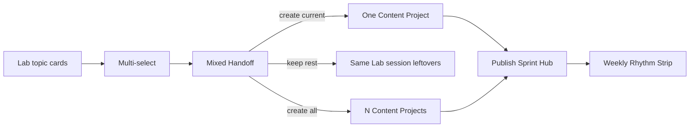
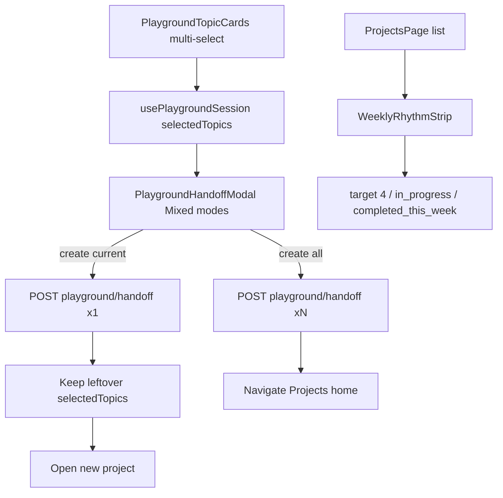

# Creator XHS Cadence Rhythm - Plan

## Goal Capsule

- **Objective:** Help a Xiaohongshu-first side-hustle creator keep a weekly publish cadence by multi-selecting Inspiration Lab topics into projects via Mixed Handoff, with a thin Weekly Rhythm Strip on the Publish Sprint Hub.
- **Product authority:** Dialogue + confirmed scoping synthesis (2026-07-13); persona grounded in prior start-from-zero XHS plan (programmer, ~2h/day, AI side-hustle, 3–4 notes/week).
- **Open blockers:** None for planning.

## Product Contract

### Summary

Extend Inspiration Lab so creators can select multiple topics and Mixed-Handoff them into Content Projects (create current only and keep the rest in-session, or create all selected), and add a thin Weekly Rhythm Strip on the projects home.
Keep Xiaohongshu as a light default on handoff, not a full workbench reposition.

### Problem Frame

The Creator Workbench already supports Brand Profile, Inspiration Lab topic/outline work, single-topic handoff, Content Pipelines, and a Publish Sprint Hub ordered by near-publish priority.
What it does not support is treating several promising topics as a short weekly slate: handoff is one project at a time, and the home surface has no weekly target vs progress signal.
For a from-zero Xiaohongshu side-hustle creator aiming at 3–4 notes per week, that gap pushes topic queues and cadence tracking back into external notes.

### Key Decisions

- **Cadence over platform reposition.** Optimize for weekly rhythm (queue → project continuity + light weekly progress), not rewriting the workbench as Xiaohongshu-only.
- **Queue lives inside Inspiration Lab.** Do not add a separate durable pending-topic library on the projects home; strengthen multi-topic selection and Mixed Handoff instead.
- **Approach A shape.** Lab multi-select + Mixed Handoff is primary; Weekly Rhythm Strip is a thin secondary surface on Publish Sprint Hub (not home-first weekly slots).
- **Session-scoped leftovers.** Topics kept after “create current only” remain in the current Inspiration Lab session only; no new server-side topic-queue entity in v1.
- **Workbench completion counts for the week.** “Completed this week” means Content Projects that reached completed status in the workbench during the current week, not verified posts on the Xiaohongshu App.
- **Quota risk is warned, not blocked by policy.** “Create all selected” may consume free-tier project capacity; the product warns and lets the creator choose.

### Actors

- A1. Side-hustle Xiaohongshu creator (primary): programmer persona, ~2 hours/day, no on-camera requirement, AI side-hustle niche, wants 3–4 notes/week.
- A2. Multi-platform creator (secondary): may still use other platforms later; this feature must not remove them, only bias handoff defaults toward Xiaohongshu + long-form when starting from Lab.

### Key Flows

- F1. Multi-select topics in Inspiration Lab
  - **Trigger:** Creator has generated topic cards and wants more than one candidate for the week.
  - **Actors:** A1
  - **Steps:** Select multiple topic cards → optionally generate/refine Structured Outline for the topic about to ship → open Mixed Handoff.
  - **Outcome:** More than one topic is marked for handoff intent without creating a separate backlog entity.
  - **Covered by:** R1, R2, R3

- F2. Mixed Handoff — create current only
  - **Trigger:** Creator confirms Mixed Handoff with “create current only.”
  - **Actors:** A1
  - **Steps:** Choose pipeline (default long-form) and platforms (default Xiaohongshu as primary) → create one Content Project from the current topic/outline → other selected topics remain available in the same Lab session.
  - **Outcome:** One project opens; weekly slate of leftover topics is still visible in-session.
  - **Covered by:** R4, R5, R6, R9, AE1

- F3. Mixed Handoff — create all selected
  - **Trigger:** Creator confirms Mixed Handoff with “create all selected.”
  - **Actors:** A1
  - **Steps:** System shows quota/capacity warning when the batch may exhaust free-tier limits → on confirm, create one Content Project per selected topic with the same pipeline/platform defaults → navigate into a sensible next project (planning picks exact navigation).
  - **Outcome:** Multiple draft projects exist; creator can advance them across the week from Publish Sprint Hub.
  - **Covered by:** R4, R7, R8, R9, AE2

- F4. Weekly Rhythm Strip on projects home
  - **Trigger:** Creator opens Publish Sprint Hub during an active week.
  - **Actors:** A1
  - **Steps:** View weekly target alongside in-progress and completed-this-week counts → resume near-publish projects as today.
  - **Outcome:** Cadence gap is visible without replacing sprint prioritization.
  - **Covered by:** R10, R11, R12, AE3

### Requirements

**Inspiration Lab multi-select and Mixed Handoff**

- R1. Inspiration Lab topic cards support selecting more than one topic for handoff intent in the current session.
- R2. Mixed Handoff offers two creation modes: create only the current topic’s project, or create projects for all currently selected topics.
- R3. When creating only the current topic, other selected topics remain available in the same Inspiration Lab session afterward.
- R4. Mixed Handoff reuses the existing handoff mapping for topic and Structured Outline into the chosen Content Pipeline; multi-select does not remove outline approval for the topic being created now.
- R5. Default handoff pipeline for this cadence path is long-form article when the creator has not chosen otherwise.
- R6. Default handoff platforms favor Xiaohongshu as primary when the creator has not chosen otherwise; other platforms remain available.
- R7. Create-all mode creates one Content Project per selected topic with shared pipeline/platform choices from the handoff confirmation.
- R8. Before create-all proceeds, the product warns when the batch is likely to exhaust free-tier creator project capacity.
- R9. Leftover selected topics are session-scoped like current Inspiration Lab state; v1 does not add a durable server-side topic queue.

**Weekly Rhythm Strip**

- R10. Publish Sprint Hub shows a thin Weekly Rhythm Strip with weekly target, in-progress count, and completed-this-week count.
- R11. Completed-this-week counts Content Projects that reached completed status in the workbench during the current week calendar boundary used by the product.
- R12. The strip does not replace Publish Sprint Hub near-publish prioritization; it is additive status only.
- R13. Default weekly target is in the 3–4 notes range appropriate for Xiaohongshu side-hustle cadence; whether the number is user-editable is deferred to planning if not settled there.

### Acceptance Examples

- AE1. Create current only
  - **Covers:** R2, R3, R5, R6
  - **Given:** Three topics selected; Structured Outline approved for topic A
  - **When:** Creator chooses Mixed Handoff “create current only” with defaults
  - **Then:** One long-form Xiaohongshu-primary project is created from topic A; topics B and C remain selected/available in the same Lab session

- AE2. Create all with quota warning
  - **Covers:** R7, R8
  - **Given:** Free-tier capacity would be exhausted by creating all selected topics
  - **When:** Creator chooses “create all selected”
  - **Then:** A clear capacity warning appears before creation; on confirm, one project per selected topic is created; on cancel, no projects are created and Lab selection is preserved

- AE3. Weekly strip reflects workbench completion
  - **Covers:** R10, R11, R12
  - **Given:** Weekly target is 4; two projects are in progress; one project was marked completed earlier this week in the workbench (not verified on Xiaohongshu App)
  - **When:** Creator opens Publish Sprint Hub
  - **Then:** Strip shows target 4, in-progress 2, completed 1, and the existing near-publish project ordering still drives the list

### Success Criteria

- SC1. A creator can leave Inspiration Lab with either one started project plus leftover in-session topics, or a batch of draft projects, without using an external title memo for that slate.
- SC2. Publish Sprint Hub makes weekly cadence gap visible in under a glance (target vs in-progress vs completed-this-week).
- SC3. Xiaohongshu remains the low-friction default on this path without removing other platforms from the workbench.
- SC4. Adoption can be observed via Lab multi-select/Mixed Handoff usage and weekly strip visibility during active creator weeks (exact event names left to planning).

### Scope Boundaries

**In scope**

- Inspiration Lab multi-select + Mixed Handoff
- Thin Weekly Rhythm Strip on Publish Sprint Hub
- Light Xiaohongshu + long-form defaults on this handoff path

**Deferred for later**

- Post-publish engagement logging (likes/saves) and “amplify what worked” replay
- Home-first weekly slot calendar (Approach B)
- 30-day launch topic pack cold start (Approach C)
- Dedicated `xhs_note` pipeline and deeper Xiaohongshu-native step copy beyond light defaults
- Durable cross-session topic queue / pending library
- Auto-publish to Xiaohongshu

**Outside this product's identity for this change**

- Repositioning the entire Creator Workbench as a Xiaohongshu-only product
- Replacing Publish Sprint Hub with a generic content calendar product

### Dependencies / Assumptions

- Inspiration Lab single-topic handoff, Structured Outline, Brand Profile, Publish Sprint Hub, and free-tier creator quotas already exist.
- Playground session state remains client-session scoped in v1 (including multi-select leftovers).
- Free-tier “project capacity” that create-all must warn about is the monthly **completed** project quota (`creator_free_completed_projects_per_month`); project **creation** is not hard-blocked today.
- Week boundary for the strip is the browser’s local calendar week (Monday–Sunday).

### Outstanding Questions

**Resolve Before Planning**

- None.

**Deferred to Implementation**

- Exact empty/error copy for partial create-all failures (network mid-batch).
- Whether create-all should soft-cap selection count in UI (suggested max 4 to match weekly target) — optional polish, not required for DoD.

### Sources / Research

- Prior creator start-from-zero guidance and workbench usage mapping in agent transcript `d8373b9f-3d04-4950-9ee9-d71d8308e0ba`.
- Existing platform option `xiaohongshu` in `creator/src/lib/platforms.ts`.
- Existing single-project playground handoff in `app/services/creator_playground.py` and `creator/src/components/PlaygroundHandoffModal.tsx`.
- Related but out-of-scope XHS prompt-guard work: `docs/brainstorms/2026-06-25-platform-prompt-guard-xhs-requirements.md`.
- Related ideation (deferred): `docs/ideation/2026-06-25-xiaohongshu-platform-ideation.html`.
- Planning research pointers: `creator/src/hooks/usePlaygroundSession.ts`, `creator/src/components/PlaygroundTopicCards.tsx`, `creator/src/pages/ProjectsPage.tsx`, `creator/src/lib/projectPriority.ts`, `app/services/creator_usage.py`, `tests/api/test_creator_playground.py`.

## Planning Contract

**Product Contract preservation:** Product Contract unchanged (R/A/F/AE IDs preserved). Planning resolved former Deferred-to-Planning items into KTDs and Assumptions below.

### Key Technical Decisions

- KTD1. **Multi-select is session-local on the frontend.** Extend `usePlaygroundSession` with `selectedTopics: PlaygroundTopic[]` while keeping a single `selectedTopic` (or derived “focus” topic) for outline generate/refine. No new backend topic-queue table.
- KTD2. **Reuse existing single-project handoff API for create-all.** Frontend loops `POST /api/v1/creator/playground/handoff` once per selected topic. No batch endpoint in v1.
- KTD3. **Create-current preserves leftovers.** After success, remove only the handed-off topic from `selectedTopics`, keep remaining selection and Lab session; do not call full `resetSession()` on create-current. Create-all may clear handed-off topics and navigate away after the batch.
- KTD4. **Handoff defaults:** pipeline default `long_article`; platforms default primary `xiaohongshu` (already partially present). Prefer these defaults when opening Mixed Handoff from Lab.
- KTD5. **Quota warning is advisory.** Before create-all, if `selectedCount > remainingCompletedQuota` (or remaining is 0), show a confirm warning that completing this many drafts this month may hit free-tier completed-project limits. Do not hard-block creation.
- KTD6. **Weekly Rhythm Strip is client-computed.** On `ProjectsPage`, derive counts from the loaded project list: `completed_this_week` via `completed_at` in local week; `in_progress` = projects with `status !== 'completed'`; target fixed default **4** in v1 (not user-editable).
- KTD7. **Navigation after create-all:** after successful batch, navigate to Publish Sprint Hub (`/creator/` projects home) so the strip and new drafts are visible; toast with created count. Create-current continues to open the new project detail (existing behavior).

### Assumptions

- “In progress” for the strip means all non-completed Content Projects owned by the user (not limited to created-this-week).
- Partial create-all failure stops the loop, keeps already-created projects, surfaces an error, and leaves remaining selected topics in session.
- Outline approval still applies to the **focus** topic being created now; create-all without per-topic outlines hands off topic title/brief only (same as today’s single handoff without outline).

### Technical Design

### Unit dependencies

U1 (session + cards) → U2 (modal + page mutation) → U3 (strip). U4 tests can parallelize once U1–U3 APIs/UI exist. Prefer frontend-first; backend schema unchanged unless create-all needs richer errors (not required).

## Implementation Units

### U1. Lab multi-select session and topic cards

- **Goal:** Creators can select multiple topic cards in Inspiration Lab; focus topic still drives outline work.
- **Requirements:** R1, R3, R9
- **Files:** `creator/src/hooks/usePlaygroundSession.ts`, `creator/src/components/PlaygroundTopicCards.tsx`, `creator/src/pages/PlaygroundPage.tsx`, optional `creator/src/hooks/usePlaygroundSession.test.ts` or component test
- **Approach:** Add `selectedTopics` array to session persistence; toggle selection on card click (checkbox or multi-active state) without clearing the whole session; keep one focus `selectedTopic` for refine/outline; switching focus clears outline only for the previous focus as today.
- **Test scenarios:**
  - Selecting a second topic adds to `selectedTopics` without dropping the first.
  - Deselecting removes from `selectedTopics`.
  - Session reload from `sessionStorage` restores multi-select.
  - Focus change still clears outline/refine for the previous focus topic.
- **Verify:** `cd creator && npx vitest run src/components/PlaygroundTopicCards.tsx` (or new session tests) and `make creator-check` if touched broadly.

### U2. Mixed Handoff modal and create-current / create-all mutations

- **Goal:** Handoff supports create-current-only vs create-all-selected with defaults, quota warning, and correct session/navigation side effects.
- **Requirements:** R2–R8, AE1, AE2
- **Files:** `creator/src/components/PlaygroundHandoffModal.tsx`, `creator/src/components/PlaygroundHandoffModal.module.css`, `creator/src/components/PlaygroundHandoffModal.test.tsx`, `creator/src/pages/PlaygroundPage.tsx`, `creator/src/api/creator.ts` (only if payload typing needs a mode field — mode can stay client-only)
- **Approach:** Extend modal with radio/segment for Mixed modes; default pipeline `long_article` and primary platform `xiaohongshu`; on confirm, page mutation either (a) single handoff then prune that topic from `selectedTopics` without full reset, or (b) sequential handoffs for each selected topic after advisory quota confirm using `usage` query from layout/cache; create-all navigates to projects home with success toast.
- **Test scenarios:**
  - Modal exposes both modes when `selectedTopics.length > 1`; single selection can still hand off (create-current equivalent).
  - Create-current success keeps leftover topics in session and navigates to new project.
  - Create-all with remaining completed quota `< N` shows warning before calling API; cancel creates nothing.
  - Create-all success issues N handoff calls and navigates home.
  - Defaults: pipeline `long_article`, platform includes `xiaohongshu` as primary when unset.
- **Verify:** `cd creator && npx vitest run src/components/PlaygroundHandoffModal.test.tsx`; existing `tests/api/test_creator_playground.py` still green (no backend change required).

### U3. Weekly Rhythm Strip on Publish Sprint Hub

- **Goal:** Projects home shows weekly target 4, in-progress count, and completed-this-week count without replacing sprint prioritization.
- **Requirements:** R10–R13, AE3
- **Files:** `creator/src/pages/ProjectsPage.tsx`, new `creator/src/components/WeeklyRhythmStrip.tsx` (+ module CSS), `creator/src/lib/weeklyRhythm.ts` (+ unit test), `creator/src/lib/projectPriority.ts` only if sharing helpers
- **Approach:** Pure helper `countWeeklyRhythm(projects, now, target=4)` using `completed_at` / `status`; render thin strip above or inside the sprint section; do not change `buildProjectPriorityView` ordering.
- **Test scenarios:**
  - Project completed earlier this week increments `completed_this_week`.
  - Completed last week does not.
  - Non-completed projects count as in-progress.
  - Strip renders target 4 with computed counts on ProjectsPage (component/smoke test).
- **Verify:** `cd creator && npx vitest run src/lib/weeklyRhythm.ts src/components/WeeklyRhythmStrip.tsx` (paths as created).

### U4. Cross-cutting creator check and API regression

- **Goal:** Ensure Lab/API regressions stay green after U1–U3.
- **Requirements:** SC1–SC4 supporting confidence
- **Files:** `tests/api/test_creator_playground.py` (run only unless a tiny assertion helps), creator vitest suite
- **Approach:** No intentional backend behavior change; run API playground tests + creator frontend check.
- **Test scenarios:**
  - Existing single handoff + outline mapping tests still pass.
  - `make creator-check` (or lint+vitest+build subset used in CI-local) passes for creator package.
- **Verify:** `uv run pytest tests/api/test_creator_playground.py -v` and `make creator-check`.

## Verification Contract

- Frontend unit/component: `cd creator && npx vitest run` (at least files touched in U1–U3).
- Frontend gate: `make creator-check`.
- Backend regression: `uv run pytest tests/api/test_creator_playground.py -v`.
- Manual smoke (optional but recommended before PR): Lab multi-select → create-current leftovers → create-all warning → home strip counts.

## Definition of Done

- All Implementation Units U1–U4 complete with their listed verifies green.
- Product Contract R1–R13 and AE1–AE3 satisfied by the shipped behavior.
- No durable topic-queue table, no batch handoff endpoint, no post-publish analytics.
- `CONCEPTS.md` already documents Mixed Handoff and Weekly Rhythm Strip; keep definitions aligned if naming drifts in UI copy.
- Plan remains the authority for scope; unexpected product scope changes require updating this artifact before expanding work.
