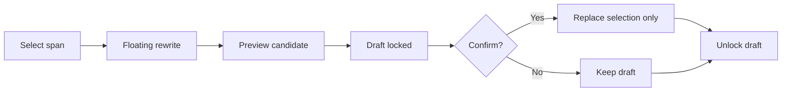
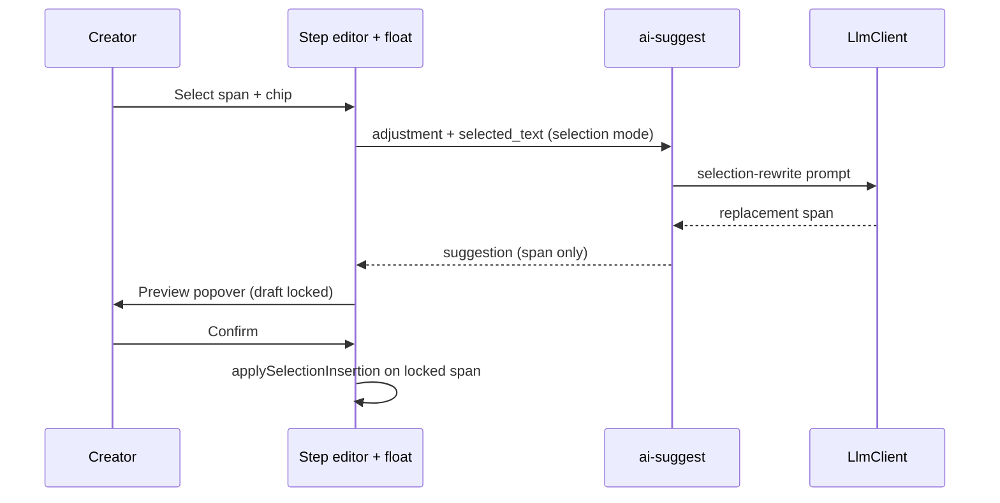

# Creator Step Selection Rewrite - Plan

## Goal Capsule

- **Objective:** Let creators revise a selected span inside the current pipeline step draft via floating rewrite actions, with a mandatory preview confirm before the selection is replaced.
- **Product authority:** Dialogue + confirmed scoping synthesis (2026-07-17); grounded in Creator Workbench Content Pipeline step editor and existing selection/AI-suggestion affordances.
- **Open blockers:** None for planning.
- **Product Contract preservation:** Product Contract unchanged (R/A/F/AE IDs preserved). Deferred planning questions D1–D3 resolved into Key Technical Decisions without changing product scope.

## Product Contract

### Summary

Add selection-first rewrite inside the current Content Pipeline step editor: select text → floating rewrite → preview → confirm to replace only that selection.
Primary success is safer adoption (fewer mistaken overwrites); faster local edits and fewer full-draft regenerations are secondary.

### Problem Frame

Creators already get whole-draft AI suggestions, selection replace from the AI panel, and read-only version history with copy.
When only one paragraph needs work, the path still leans toward regenerate-or-adopt-all, which feels heavy and easy to overwrite by mistake.
Evidence of real-world workarounds was not established in this brainstorm; the need is treated as a product bet on revision friction inside the step editor.

### Key Decisions

- **Selection float + light preview, not a new editor product.** Prefer extending the current step draft surface over a full dual-pane rewrite workspace or patch/diff review UI.
- **Preview confirm is a hard delivery gate.** Shipping floating rewrite without a confirmable preview does not count as done.
- **Lock the draft while preview is open.** Until the creator confirms or cancels, the underlying draft and selection cannot change; cancel or confirm releases the lock.
- **Current step only.** Rewrite applies only to the active step editor selection; no cross-step batch rewrite.
- **Safety over speed as the primary acceptance signal.** Preview-before-write and reduced mis-replace matter more than raw time-to-edit, though both remain goals.

### Actors

- A1. Multi-platform creator using Creator Workbench Content Pipeline step drafts (assumed primary actor; no named field evidence in this brainstorm).

### Key Flows

- F1. Selection rewrite with preview confirm
  - **Trigger:** A1 has non-empty selection in the active step editor and chooses a floating rewrite action.
  - **Actors:** A1
  - **Steps:** Select span → open floating rewrite → request rewrite → review preview → confirm replace selection or cancel → draft unlocks.
  - **Outcome:** On confirm, only the selected span is replaced with the previewed text; on cancel, the draft is unchanged.
  - **Covered by:** R1–R6, AE1–AE3

### Requirements

**Selection rewrite entry**

- R1. When the active step editor has a non-empty selection, the creator can start a selection rewrite from a floating control near the selection (not only from the side AI suggestion panel).
- R2. Selection rewrite applies only to the current pipeline step draft; it does not rewrite other steps or batch across projects.

**Preview and apply**

- R3. Every selection rewrite shows a preview of the candidate replacement before any draft mutation.
- R4. The creator must explicitly confirm to apply, or cancel to discard; cancel leaves the draft unchanged.
- R5. Confirm replaces only the original selection span with the previewed text; it does not replace the entire draft unless the selection was the entire draft.
- R6. While a preview is open, the draft surface and selection are locked until confirm or cancel.

**Success behavior**

- R7. The feature’s primary acceptance signal is safer adoption: preview-before-write makes mistaken full or partial overwrites harder than today’s adopt/replace paths for the same local edit intent.

### Acceptance Examples

- AE1. Preview required before write
  - **Covers:** R3, R4
  - **Given:** A1 selected a mid-draft paragraph and requested a step adjustment chip (e.g. “更短”)
  - **When:** The rewrite candidate returns
  - **Then:** A preview is shown and the draft text is still the pre-request content until A1 confirms
- AE2. Confirm replaces selection only
  - **Covers:** R5
  - **Given:** Draft is “钩子。旧中间段。CTA。” and selection is “旧中间段”
  - **When:** A1 confirms a preview of “新中间段”
  - **Then:** Draft becomes “钩子。新中间段。CTA。”
- AE3. Preview lock
  - **Covers:** R6
  - **Given:** Preview is open for a selection rewrite
  - **When:** A1 tries to edit the textarea or change the selection
  - **Then:** The draft stays locked until confirm or cancel; no alternate selection rewrite can start on top of the open preview
- AE4. Cancel is a no-op
  - **Covers:** R4
  - **Given:** Preview is open
  - **When:** A1 cancels
  - **Then:** Draft content and selection restore to the pre-preview interaction state (content unchanged; lock released)

### Success Criteria

- SC1. Creators can complete a local paragraph fix without adopting a full AI draft when only a span needed change.
- SC2. Mis-replace incidents for selection rewrites are visibly harder than today because confirm is mandatory after preview.
- SC3. Full-draft regenerate remains available but is no longer the only comfortable path for local fixes.

### Scope Boundaries

**In scope**

- Floating selection rewrite on the current step editor
- Mandatory preview confirm and draft lock during preview
- Replace-selection-only apply behavior

**Deferred for later**

- Richer multi-block compare UI beyond light preview
- Tighter coupling of rewrite history into version history browsing
- Measuring regenerate-rate drop as a formal product metric dashboard

**Out of scope (this slice)**

- Patch/diff accept-reject review UI
- Full-page dual-column compare editor
- One-click restore/rollback from version history into the editor
- Cross-step or cross-project batch rewrite
- First-draft quality as the primary investment of this slice
- Inspiration Lab topic/outline flows as the primary surface (pipeline step editor only)

### Dependencies / Assumptions

- A1’s pain is inferred; no concrete workaround evidence was captured in dialogue.
- Existing step editor selection tracking and AI suggestion “replace selection” behavior are the baseline to extend, not replace wholesale.
- Quota / billing rules for rewrite calls follow existing creator AI usage policy (same `ai_calls` counter as full-step suggest).

### Outstanding Questions

**Resolve Before Planning**

- None.

**Deferred to Planning** — resolved 2026-07-17

- D1 → KTD1 / KTD3: floating control near selection; reuse `STEP_AI_ADJUSTMENTS` chips for the active step.
- D2 → KTD1 / KTD4: extend existing `ai-suggest`; share quota with full-step suggest (1 call per rewrite).
- D3 → KTD2: light preview popover anchored near the selection (not a centered dual-pane dialog).

### Sources / Research

- Creator routes and surfaces: `creator/src/App.tsx` (projects, playground, assets, brand, account).
- Step editor selection + AI replace selection: `creator/src/components/StepEditorPanel.tsx`, `creator/src/components/AiSuggestionPanel.tsx`, `creator/src/lib/editorSelection.ts`.
- Version history is read-only + copy today: `creator/src/components/StepVersionHistory.tsx`.
- Backend AI path: `app/api/v1/creator/ai.py`, `app/services/creator_ai.py`, `app/schemas/creator/ai.py`, `app/creator/prompts/`.
- Domain vocabulary: `CONCEPTS.md` (Creator Workbench, Content Pipeline, Pipeline Step, Selection Rewrite Preview).

---

## Planning Contract

### Summary

Extend the existing step `ai-suggest` contract with an optional selection-rewrite mode that returns a single replacement span, then build a floating rewrite + preview-lock UX on the current step editor that applies via existing `editorSelection` helpers.
Whole-draft suggest and the side AI panel remain unchanged as the regenerate path.

### Key Technical Decisions

- **KTD1. Extend `POST .../ai-suggest`, do not add a parallel rewrite route.** Optional request fields carry the selected span (and mode); response stays `AiSuggestOut` with `suggestion` as the replacement text only. Avoids a second quota/auth surface.
- **KTD2. Light preview popover near the selection.** Show candidate text with Confirm / Cancel next to the float; not a full dual-column editor and not a centered modal-as-editor.
- **KTD3. Reuse per-step adjustment chips on the float bar.** Source labels/adjustments from `STEP_AI_ADJUSTMENTS` / `adjustmentsForStep` for the current step key (same strings the side panel already uses).
- **KTD4. Same AI quota as full-step suggest.** Each selection rewrite increments `ai_calls` once via `CreatorUsageService`, matching today’s suggest path.
- **KTD5. Selection mode is always single-span output.** Even on multi-variant steps (`uses_multi_variant`), selection rewrite returns one replacement string (variants list may be empty or a single entry). Do not emit three full-draft angles for a span rewrite.
- **KTD6. Draft lock is client-owned.** Preview open ⇒ textarea disabled / selection frozen until confirm or cancel; no new server draft lock entity.

### High-Level Technical Design

### Assumptions

- Side-panel “替换选中” can remain an immediate apply path in this slice; the new float path is the preview-gated selection rewrite. Tightening the side panel to also require preview is deferred follow-up if product later wants one rule everywhere.
- Selection rewrite prompt includes surrounding draft context only as needed for coherence; the model must output the replacement span, not the full draft.

### Open Questions

**Deferred to Implementation**

- Exact popover positioning relative to textarea caret/selection geometry on mobile vs desktop.
- Whether empty `variants` vs single-item `variants` is cleaner for OpenAPI clients when in selection mode (behaviorally equivalent if `suggestion` is authoritative).

---

## Implementation Units

### U1. Selection-aware `ai-suggest` backend

- **Goal:** Accept selection-rewrite input on the existing suggest endpoint and return a single replacement span under the same ownership, step-gating, and quota rules as full-step suggest.
- **Requirements:** R2, R5 (server returns span-only content), F1; quota assumption
- **Dependencies:** None
- **Files:**
  - Modify: `app/schemas/creator/ai.py`
  - Modify: `app/api/v1/creator/ai.py`
  - Modify: `app/services/creator_ai.py`
  - Modify: `app/creator/prompts/__init__.py` (and/or a small dedicated prompt helper under `app/creator/prompts/`)
  - Test: `tests/api/test_creator_ai.py`
- **Approach:**
  - Add optional fields on `AiSuggestIn` for selection rewrite (e.g. mode + non-empty `selected_text`, with length capped to step draft limits).
  - When selection mode is active, build a prompt that rewrites only that span given brand/context/adjustment; skip multi-variant JSON path (KTD5).
  - Keep `check_ai_quota` / `increment_ai` on the same path as full suggest (KTD4).
  - Reject invalid selection payloads with `AppException` (empty selection text, selection mode without text).
- **Patterns to follow:** `CreatorAiService.suggest`, `tests/api/test_creator_ai.py` monkeypatched `LlmClient.complete`, `ApiResponse` + `AppException` conventions in `.cursor/skills/fastapi-kit-backend/SKILL.md`.
- **Test scenarios:**
  - Happy path: selection mode returns 200; `data.suggestion` is the fake span; `ai_calls` increments by 1.
  - Covers AE2 (content contract): response is span-sized, not a forced full-draft wrapper.
  - Multi-variant step + selection mode: still returns a single suggestion path (no 3-angle full drafts).
  - Error: selection mode with empty `selected_text` → 4xx business error.
  - Unchanged: full-step suggest without selection fields still behaves as today (including multi-variant topic when applicable).
  - Quota: selection rewrite blocked when quota exceeded (same codes as existing suggest).
- **Verification:** New/updated API tests in `tests/api/test_creator_ai.py` pass; existing suggest cases still pass.

### U2. Floating rewrite + preview lock in the step editor

- **Goal:** When the active step has a non-empty selection, show a floating rewrite control that calls selection-mode suggest, previews the candidate, locks the draft until confirm/cancel, and applies only via selection replace.
- **Requirements:** R1–R7, F1, AE1–AE4, SC1–SC3
- **Dependencies:** U1
- **Files:**
  - Modify: `creator/src/api/ai.ts` (and types in `creator/src/types/api.ts` as needed)
  - Modify: `creator/src/components/StepEditorPanel.tsx` (+ CSS module)
  - Create or modify: floating rewrite / preview UI component(s) under `creator/src/components/`
  - Modify: `creator/src/pages/ProjectDetailPage.tsx` and/or `creator/src/pages/project-detail/ProjectWizardView.tsx`
  - Modify: `creator/src/hooks/useProjectStepAi.ts` (or a focused sibling hook) to support selection-mode suggest without clobbering side-panel suggestion state incorrectly
  - Test: `creator/src/components/StepEditorPanel.test.tsx` and/or new component tests; extend `creator/src/pages/ProjectDetailPage.test.tsx` if wiring is covered there
  - Reuse: `creator/src/lib/editorSelection.ts`, `creator/src/lib/stepAiAdjustments.ts`
- **Approach:**
  - On non-empty selection (and AI-enabled non-publish step), render float with chips from `adjustmentsForStep(stepKey)`.
  - Chip click → selection-mode `aiSuggest` with current selected text + adjustment; show loading on the float/preview.
  - On success → open light preview popover with candidate; set draft-lock (disable textarea / ignore selection changes / block competing float actions) until Confirm or Cancel (KTD2, KTD6).
  - Confirm → `applySelectionInsertion` (or equivalent) using the selection captured at rewrite start; then unlock and clear preview.
  - Cancel → unlock; draft unchanged (AE4).
  - Do not mutate draft content when the LLM returns; only preview state holds the candidate until confirm (AE1).
- **Execution note:** Prefer component-level tests for preview lock and confirm/cancel; keep API client typing aligned with U1 fields.
- **Patterns to follow:** `AiSuggestionPanel` adopt/replace affordances, `editorSelection` helpers + tests, Creator CSS Modules / mint AI accent in `creator/FRONTEND.md`.
- **Test scenarios:**
  - Covers AE1: after rewrite returns, draft value prop unchanged until confirm.
  - Covers AE2: confirm replaces only the selected span in the composed draft string.
  - Covers AE3: while preview open, editor is disabled / selection rewrite cannot restart.
  - Covers AE4: cancel leaves content unchanged and releases lock.
  - Happy path: non-empty selection shows float; empty selection does not.
  - Edge: selection invalidated if parent clears content while idle (no preview) — float hides; under lock, content cannot change.
  - Error: selection suggest failure shows existing quota/error handling without writing draft.
- **Verification:** Creator unit tests for the new UX pass; side-panel full suggest still works on the same page.

### U3. Wizard wiring smoke and regression guards

- **Goal:** Ensure Project wizard still auto-suggests empty later steps and can use the side AI panel without regressing when selection rewrite is present.
- **Requirements:** SC3; preserve existing AI suggest entry points
- **Dependencies:** U2
- **Files:**
  - Modify/extend: `creator/src/pages/ProjectDetailPage.test.tsx` and/or `creator/src/components/AiSuggestionPanel.test.tsx`
  - Optional: `tests/api/test_creator_ai.py` only if U1 left a shared helper worth asserting from both modes
- **Approach:** Add focused regression coverage that full-draft suggest/adopt path remains available alongside the float path; avoid duplicating all of U2’s scenarios.
- **Test scenarios:**
  - Side panel still offers adopt-all / insert / replace-selection when a whole-draft suggestion exists.
  - Selection rewrite preview path does not clear or auto-apply into the side-panel suggestion store unexpectedly (or documents intentional isolation if states are separate).
- **Verification:** Targeted creator tests pass; no change required to Inspiration Lab routes.

---

## Verification Contract

- **Backend:** `uv run pytest tests/api/test_creator_ai.py -v` (and broader `uv run pytest -v` / `make check` before merge).
- **Creator frontend:** `make creator-check` or the repo’s creator test/lint/build subset covering touched files.
- **Manual smoke:** On an AI-enabled script/body step with draft text, select a mid-span → chip → preview → confirm; cancel path once; confirm full-draft regenerate still works from the side panel.
- **Quality gates:** Match CI — backend ruff/mypy/pytest; creator test/lint/build.

## Definition of Done

- R1–R7 and AE1–AE4 are satisfied in the current step editor.
- U1–U3 complete with enumerated tests green.
- Product out-of-scope items remain out (no patch UI, dual-column editor, version restore, cross-step batch).
- `CONCEPTS.md` already defines Selection Rewrite Preview; no further glossary churn required unless naming drifts in implementation.

---

## System-Wide Impact

- **API consumers:** Optional fields on `AiSuggestIn`; existing clients omitting them keep full-draft behavior.
- **Quota:** Selection rewrites consume the same daily AI budget as regenerates — expect slightly higher call volume if creators rewrite locally often.
- **UX:** Float + preview adds a mint-accent AI surface inside the editor canvas; keep Nav Accent Split conventions (coral nav / mint AI).

## Risks & Dependencies

- **Risk:** Model returns a full draft instead of a span → confirm would blow the selection. **Mitigation:** Prompt hard-constraint + frontend treat `suggestion` as span-only; optional soft length heuristic deferred to implementation if needed.
- **Risk:** Dual paths (side-panel immediate replace vs float preview) confuse users. **Mitigation:** Accepted for v1; float is the promoted local-edit path; follow-up can unify preview rules.
- **Dependency:** LLM availability and existing creator AI quota configuration — same as current suggest.

### Deferred to Follow-Up Work

- Require preview confirm on side-panel “替换选中” as well.
- Formal metrics for regenerate-rate drop.
- Richer compare UI / version history restore.
