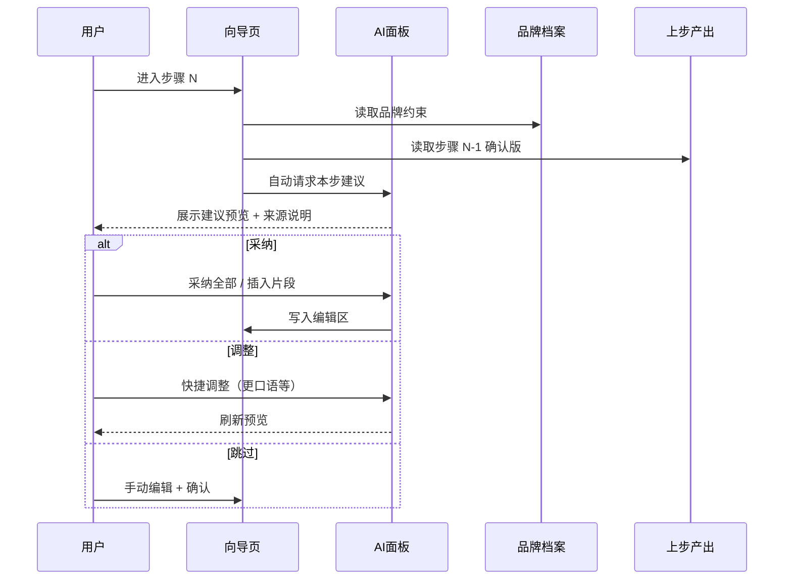

# Creator 产品原型设计（从零重定义）

## Summary

在保留「内容生产流水线」核心使命的前提下，从零重定义 Creator 的产品形态与交互。改版焦点为 **AI 融入方式**：由按钮触发的「AI 建议」改为步骤内嵌的「上下文工作台」——进入每步即见基于品牌档案与上步产出的 AI 建议面板，用户显式采纳后方写入编辑区。内容形态维持短视频 + 长图文双流水线、线性 7 步向导；信息架构精简为三主入口（项目、品牌档案、账号）。

---

## Design Decisions（澄清记录）

| 维度 | 选择 |
|------|------|
| 设计起点 | 从零重定义（保留技术底座，重做产品叙事与交互） |
| 核心使命 | 内容生产流水线 |
| 内容形态 | 短视频 + 长图文，各自独立流水线 |
| 交互范式 | 线性向导 |
| 改版痛点 | AI 像外挂按钮，与品牌记忆、步骤上下文脱节 |
| AI 形态 | 步骤内嵌助手面板（非对话副驾） |
| 选定方案 | **方案 A：上下文工作台**（第 3 步起轻量预生成建议草稿） |

---

## Product Vision

**一句话：** Creator 是带品牌记忆的创作流水线——每一步都知道你是谁、前面写了什么，AI 是步骤里的协作者，不是工具栏上的按钮。

### 设计原则

1. **上下文先行** — 品牌约束与上步产出以芯片形式常驻可见；AI 建议默认标注来源。
2. **一步一事** — 线性向导每步只解决一个创作决策，步骤文案用创作术语（钩子、分镜、封面）。
3. **建议可采纳** — AI 产出在面板内预览，用户显式「采纳」后才进入编辑区，禁止静默覆盖。
4. **流水线语义** — 避免通用 PM 语言；界面围绕创作者工作流组织。

---

## Approach Comparison

### 方案 A：上下文工作台（采用）

每步固定布局：步骤条 → 主编辑区 → AI 内嵌面板。进入步骤时 AI 面板自动展示建议；顶部展示上下文芯片。第 3 步及之后，若上步已确认，面板自动加载建议草稿（预览态，非强制写入）。

- **优点：** 符合步骤内嵌助手诉求；AI 价值一步可见；品牌记忆不再藏在设置页。
- **缺点：** 单屏信息密度高，需严格视觉层级。

### 方案 B：固定副驾对话栏（不采用）

右侧 30% 常驻 AI 对话，用户用自然语言指挥，产出写入左侧编辑区。

- **优点：** 灵活、交互熟悉。
- **缺点：** 仍像外挂工具；与步骤语义弱绑定；用户需会写 prompt。

### 方案 C：智能草稿优先（部分吸收）

进入每步时 AI 已预填草稿，用户直接改。

- **优点：** 减少空白页焦虑。
- **缺点：** 前几步预生成价值低；易跳过品牌校准。仅作为方案 A 在第 3 步后的轻量变体。

---

## Information Architecture

```
未登录: 登录/注册 · 找回密码

已登录:
  项目列表（首页）
    → 项目向导（核心）
  品牌档案
  账号设置
```

### 导航

| 入口 | 职责 |
|------|------|
| 项目 | 列表、新建、进度与发布状态一览 |
| 品牌档案 | 全局 AI 上下文源；向导内通过芯片可跳转 |
| 账号 | 配额、改密、套餐 |

### 明确不落地（原型不画）

- 数据看板、素材库、选题灵感库
- 多级侧栏导航
- 看板/拖拽视图
- 对话式全局 AI 副驾
- 自定义流水线编辑器
- 多平台自动发帖 API

---

## Screen Inventory（原型图清单）

### 核心页面（6 张）

| ID | 文件名（建议） | 页面 | 说明 |
|----|----------------|------|------|
| P1 | `prototype-v2-login.png` | 登录/注册 | 价值主张强调「流水线 + 品牌记忆 AI」 |
| P2 | `prototype-v2-projects.png` | 项目列表（有项目） | 含新建表单；卡片展示步骤进度与发布状态 |
| P3 | `prototype-v2-wizard.png` | 项目向导 | **核心改版页**：上下文芯片 + 双栏（编辑区 / AI 面板） |
| P4 | `prototype-v2-brand.png` | 品牌档案 | 四字段 + 「预览效果」区 |
| P5 | `prototype-v2-publish.png` | 发布核对（步骤 7） | 按平台分组 checklist + 顶部汇总条 |
| P6 | `prototype-v2-completed.png` | 项目完成态 | 各步摘要 + 平台发布时间线 |

### 变体 / 边界态（4 张）

| ID | 文件名（建议） | 状态 |
|----|----------------|------|
| V1 | `prototype-v2-projects-empty.png` | 空项目列表 + 首条流水线引导 |
| V2 | `prototype-v2-wizard-ai-loading.png` | AI 面板骨架屏 + 生成中文案 |
| V3 | `prototype-v2-wizard-quota.png` | AI 次数用尽，面板替换为限额提示 |
| V4 | `prototype-v2-wizard-mobile.png` | ≤900px：步骤条横滑 + AI 底部抽屉 |

**存放路径：** `creator/docs/prototypes/v2/`（与 v1 并存，便于对比）

---

## P3 项目向导（核心布局规格）

### 桌面布局（≥900px）

```
┌──────────────────────────────────────────────────────────────┐
│ ← 项目列表   {标题} · {流水线} · {平台}              步骤 N/7 │
├──────────────────────────────────────────────────────────────┤
│  步骤进度条（7 步，已完成 ✓ / 当前 ● / 未到 ○）              │
├──────────────────────────────────────────────────────────────┤
│ 上下文芯片: [语气] [受众] [禁忌] [上步摘要…]  （可点击→品牌）  │
├───────────────────────────────┬──────────────────────────────┤
│  {本步标题}                    │  AI 建议 · {本步名称}         │
│  {本步引导文案}                │  ┌ 建议预览（只读）────────┐  │
│  ┌ 主编辑 textarea ─────────┐ │  │                        │  │
│  │                          │ │  └────────────────────────┘  │
│  └──────────────────────────┘ │  [采纳全部][插入][换一版]     │
│  {字数} / 2000                │  [快捷调整 chips]            │
│                               │  来源: 品牌档案 · 步骤X · 平台 │
├───────────────────────────────┴──────────────────────────────┤
│ [暂存草稿]                              [确认并下一步 →]       │
└──────────────────────────────────────────────────────────────┘
```

### 与 v1 实现的关键差异

| v1（现实现） | v2（本设计） |
|--------------|--------------|
| AI = 按钮行「AI 建议」 | AI = 固定右侧面板，进入步骤即见 |
| 品牌档案仅在独立页 | 上下文芯片常驻向导顶栏 |
| 生成结果直接覆盖编辑区 | 面板预览 → 用户显式采纳 |
| 无上步摘要 | 芯片展示上步确认内容摘要 |
| 无定向调整 | 面板提供本步相关快捷调整 |

### 响应式（≤900px）

- 步骤条横向滚动
- AI 面板折叠为编辑区下方可展开区块（默认展示摘要一行 + 「展开 AI 建议」）
- 上下文芯片单行横滑

---

## AI Integration Model

### 进入步骤时的行为



### AI 面板固定结构

1. **标题** — `AI 建议 · {本步名称}`
2. **建议预览区** — 只读，可滚动
3. **操作组** — 采纳全部 / 插入光标处 / 换一版
4. **快捷调整** — 2–3 个本步相关 chips（如「更口语」「更短」）
5. **来源脚注** — `基于：品牌档案 · 步骤②钩子 · 目标平台抖音`

### 步骤级 AI 策略

| 步骤类型 | 进入时行为 | 快捷调整示例 |
|----------|------------|--------------|
| 选题 / 钩子 | 面板显示引导问题，不长文预生成 | 再给 3 个角度 |
| 脚本 / 正文 | 自动加载建议草稿（预览） | 更口语 / 更短 / 加强钩子 |
| 分镜 / 配图 | 结构化列表建议 | 更细 / 更简 |
| 封面 / 标题 | 多版本候选（3 条） | 更吸引点击 / 更 SEO |
| 发布核对 | 无新生成；展示前文 AI 产出摘要供核对 | — |

### 配额用尽（V3）

- AI 面板区域替换为 `QuotaLimitNotice` 样式区块
- 主编辑区仍可用（手动完成该步）
- 不阻断「确认并下一步」

---

## Pipeline Definitions

### 短视频（7 步）

1. 选题确认
2. 钩子 / 提纲
3. 口播脚本
4. 分镜要点
5. 封面 / 标题
6. 素材 / B-roll 备注
7. 发布核对

### 长图文（7 步）

1. 选题确认
2. 大纲
3. 正文
4. 标题 / 摘要
5. 配图要点
6. 关键词 / 多平台标题变体
7. 发布核对

每步面板首行文案格式：**「本步你要决定：{决策描述}」**，降低步骤迷失感。

---

## P2 项目列表卡片规格

每张项目卡片须展示：

- 选题标题（主）
- 流水线类型标签（短视频 / 长图文）
- 步骤进度（7 圆点或 `步骤 N/7`）
- 发布状态（未发 / 部分已发 `X/Y 平台` / 已完成 ✓）
- 最后更新时间（次要）

新建项目表单置于列表顶部（非弹窗），字段：流水线类型、选题、目标平台多选。

---

## P4 品牌档案

保留四字段：语气、受众、禁忌词、结构偏好。

**新增「预览效果」区：**

- 根据当前字段值生成 1–2 句示例文案
- 展示 AI 将如何解读这些约束（标签 + 示例句）
- 保存后 toast：「品牌档案已更新，后续 AI 建议将应用新约束」

---

## P5 发布核对

- 顶部汇总条：`{已完成平台数}/{总平台数} 平台已核对 · {待完成项数} 项待完成`
- 按平台分组 checklist（沿用现有 `PLATFORM_CHECKLISTS` 语义）
- 每平台卡片可折叠；全部勾选后高亮「完成项目」CTA

---

## Visual Direction

延续暗色编辑室基调，强化 AI 区域辨识度：

| Token | 值 | 用途 |
|-------|-----|------|
| `--bg` | `#0c0f14` | 页面背景 |
| `--panel` | `#1a2030` | 主编辑区 |
| `--ai-panel` | `#141a22` | AI 面板背景 |
| `--accent` | `#f2b84b` | 主操作、芯片描边 |
| `--success` | `#4ade80` | 完成态 |
| `--font-display` | Instrument Serif | 页面标题 |
| `--font` | DM Sans | 正文 |

AI 面板左侧 3px 琥珀竖线作为区域标识。上下文芯片：深底 + 琥珀描边，hover 可跳转品牌档案。

---

## Scope Boundaries

### In scope（本原型）

- 10 张 v2 高保真 mock（6 核心 + 4 变体）
- 向导双栏布局与 AI 面板交互规格
- 上下文芯片与品牌档案联动
- 项目卡片进度/发布状态表达

### Out of scope（后续版本）

- 后端 API 变更细节（留 implementation plan）
- 对话式全局 AI
- 看板视图、素材库、数据看板
- 自动发帖、自定义流水线
- 像素级标注与 Figma 组件库（本阶段为产品原型级 mock）

---

## Success Criteria（原型验收）

- [ ] 评审者能在 P3 单页理解「AI 如何融入步骤」而无需读说明文档
- [ ] 品牌记忆在向导内可见（芯片），不依赖跳转品牌页才能感知
- [ ] AI 建议与编辑区职责分离清晰（预览 vs 采纳）
- [ ] 10 张 mock 覆盖登录→建项→向导→发布→完成全链路及 4 种边界态
- [ ] 与 v1 原型对比，改版焦点（AI 融入）一目了然

---

## Next Step

用户已确认本设计。下一步：invoke **writing-plans** 技能，产出 v2 原型绘制 + 前端实现的实施计划。
